# CICD GitHub Action Example #
[](https://sonarcloud.io/project/overview?id=judebantony_cicd-github-action-example)
[](https://sonarcloud.io/component_measures/metric/coverage/list?id=judebantony_cicd-github-action-example)
[](https://sonarcloud.io/component_measures/metric/reliability_rating/list?id=judebantony_cicd-github-action-example)
[](https://sonarcloud.io/component_measures/metric/security_rating/list?id=judebantony_cicd-github-action-example)
[](https://sonarcloud.io/component_measures/metric/code_smell/list?id=judebantony_cicd-github-action-example)
[](https://sonarcloud.io/component_measures/metric/code_smell/list?id=judebantony_cicd-github-action-example)
[](https://app.fossa.com/projects/git%2Bgithub.com%2Fjudebantony%2Fcicd-github-action-example?ref=badge_shield)

[](https://github.com/judebantony/cicd-github-action-example/actions/workflows/test.yml)

[](https://codecov.io/gh/judebantony/cicd-github-action-example)


## CICD - DevSecOps using GitHub Action ##

DevSecOps automatically bakes in security at every phase of the software development lifecycle, enabling development of secure software at the speed of Agile and DevOps. It integrates application and infrastructure security seamlessly into Agile and DevOps processes and tools. It addresses security issues as they emerge, when they're easier, faster, and less expensive to fix and also makes application and infrastructure security a shared responsibility of development, security, and IT operations teams.

Implementing “[shift left](https://www.devsecops.org/blog/2016/5/20/-security)” to a DevOps team guarantees application security at the earliest stages in the development lifecycle, as part of DevSecOps (collaboration between development, security, and operations). To shift left means to move a process to the left on the traditional linear depiction of the software development lifecycle (SDLC). There are two common subjects of shift left initiatives in DevOps: security and testing. 

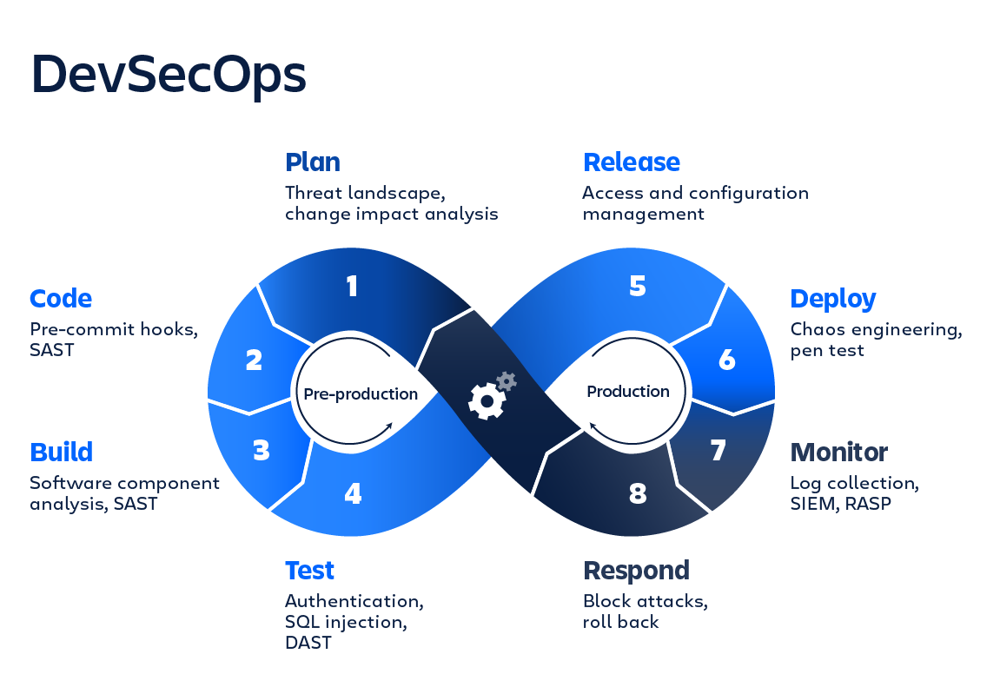

This is a sample project to demonstrate the E2E Github Action release workflow with all Security Controls gates integrated with different Cloud SaaS CI/CD tools offering.

#### Tools used are listed below ####

* Requirements & Planning
    * [JIRA](https://judebantony.atlassian.net)
* Language used
    * [Spring Boot](https://spring.io/projects/spring-boot)
    * [Java](https://www.java.com/en/)
* SCM
    * [GitHub](https://github.com)	
* Build
    * [Mavan](https://maven.apache.org)
* Continuous Integration 
    * [Github Action](https://github.com/features/actions)
* Code Quality
    * [SonarQube](https://sonarcloud.io/organizations/judebantony/projects)
    * [Codecov](https://codecov.io/gh/judebantony/cicd-github-action-example/commit/4b9f0f601ab2feee0e409ede57283d5b99b9182d/build)  	
* SAST (Static Analysis Security Testing)
    * [CodeQL](https://docs.github.com/en/code-security/code-scanning/automatically-scanning-your-code-for-vulnerabilities-and-errors/about-code-scanning-with-codeql)
    * [HCL AppScan CodeSweep](https://www.hcltechsw.com/appscan/codesweep)	
    * [Codacy](https://www.codacy.com/products/sonarqube-alternatives?utm_term=sonarqube&utm_campaign=SEA+-+Competitors&utm_source=adwords&utm_medium=ppc&hsa_acc=9882323101&hsa_cam=11598890837&hsa_grp=112569261106&hsa_ad=493336668133&hsa_src=g&hsa_tgt=kwd-57815990976&hsa_kw=sonarqube&hsa_mt=b&hsa_net=adwords&hsa_ver=3&gclid=CjwKCAiA4veMBhAMEiwAU4XRr_qVWrji3IRgivxyqqPc3QrEMVwBQmQoACBfPuCL5H0gE0nmn3n2LhoCcgkQAvD_BwE)
    * [42crunch](https://platform.42crunch.com)
    * [Fortify](https://www.microfocus.com/en-us/cyberres/application-security/static-code-analyzer?utm_campaign=7018e000000PgpeAAC&utm_content=Search-NB-SEC-Fortify-APJ&gclid=Cj0KCQiAzMGNBhCyARIsANpUkzNu_PaYL3ERhZ-KktUnSxHBTZbFkEOqZYAHFDfE-7m4jviXVhtoUKAaAsSFEALw_wcB)
    * [Coverity](https://www.synopsys.com/software-integrity/security-testing/static-analysis-sast.html?utm_source=google&utm_medium=cpc&utm_term=&utm_campaign=G_S_Coverity_BMM_India&cmp=ps-SIG-G_S_Coverity_BMM_India&gclid=Cj0KCQiAzMGNBhCyARIsANpUkzNY7xgotkaFx4ZukqPDQdZjn6tKU_xYAdWO_Y2t5kD_YpiP5m7DYdAaAlYREALw_wcB)
    * [Checkmarx](https://checkmarx.com)
* SCA (Software Composition Analysis)
    * [Snyk](https://app.snyk.io/org/judebantony)
    * [Dependabot](https://github.blog/2020-06-01-keep-all-your-packages-up-to-date-with-dependabot/)
    * [BlackDuck CoPilot](https://copilot.blackducksoftware.com/github/repos/judebantony/cicd-github-action-example/results) 
    * [FOSSA](https://app.fossa.com/projects/git%2Bgithub.com%2Fjudebantony%2Fcicd-github-action-example/refs/branch/main/0116ae3eef023ccfb56995ab2c4b10aaf5ffe1e1)
    * [Shift Left](https://www.shiftleft.io/apps/shiftleft-java-demo/vulnerabilities?scan=1&branch=demo-branch-1638196402&severity=critical)		
* DAST (Dynamic Application Security Testing)
    * [StackHawk](https://app.stackhawk.com/applications)
    * [OWASP ZAP](https://www.zaproxy.org)
* OpenAPI Spec Validator
    * [Swagger Editor Validator](https://swagger.io/blog/api-design/validate-openapi-definitions-swagger-editor/)  
* Infra as Code Scan
    * [Snyk](https://snyk.io)
    * [OPA](https://www.openpolicyagent.org)
* Secret Scan
    * [Trufflehog](https://github.com/trufflesecurity/truffleHog)
    * [GitGuardian](https://dashboard.gitguardian.com/workspace/190186/analytics)
* Maven Repository
    * [Jfrog Artifactory](https://jfrog.com/artifactory/?utm_source=google&utm_medium=cpc&utm_campaign=14808689020&utm_term=jfrog%20artifactory&utm_network=g&cq_plac=&cq_plt=gp&gclid=Cj0KCQiAhf2MBhDNARIsAKXU5GTNwwGiZx5Msn96nvS7v3kLKexhg50OTeKFkyYJSfFDkmnKLb0OH38aAiOTEALw_wcB)
     * [Github Package](https://github.com/trufflesecurity/truffleHog)
* Helm Repository
    * [Jfrog Artifactiory](https://jfrog.com/artifactory/?utm_source=google&utm_medium=cpc&utm_campaign=14808689020&utm_term=jfrog%20artifactory&utm_network=g&cq_plac=&cq_plt=gp&gclid=Cj0KCQiAhf2MBhDNARIsAKXU5GTNwwGiZx5Msn96nvS7v3kLKexhg50OTeKFkyYJSfFDkmnKLb0OH38aAiOTEALw_wcB)
* Container Scan - Docker Image
    * [Snyk](https://snyk.io)
    * [JFrog Xray](https://jfrog.com/artifactory/?utm_source=google&utm_medium=cpc&utm_campaign=14808689020&utm_term=jfrog%20artifactory&utm_network=g&cq_plac=&cq_plt=gp&gclid=Cj0KCQiAhf2MBhDNARIsAKXU5GTNwwGiZx5Msn96nvS7v3kLKexhg50OTeKFkyYJSfFDkmnKLb0OH38aAiOTEALw_wcB)
* Container Repository
    * [JFrog Artifactory](https://jfrog.com/artifactory/?utm_source=google&utm_medium=cpc&utm_campaign=14808689020&utm_term=jfrog%20artifactory&utm_network=g&cq_plac=&cq_plt=gp&gclid=Cj0KCQiAhf2MBhDNARIsAKXU5GTNwwGiZx5Msn96nvS7v3kLKexhg50OTeKFkyYJSfFDkmnKLb0OH38aAiOTEALw_wcB)
    * [Github Package](https://github.com/features/packages)
    * [DockerHub](https://hub.docker.com/r/judebantony/cigithubaction)
* Deploying to Azure - AKS
    * [GitHub Action & K8S native](https://kubernetes.io)
    * [GitHub Action & Helm Chart](https://helm.sh/docs/topics/charts/)
* Deploying to GCP - GKE 
    * [GitHub Action & Harness](https://harness.io)
* Provisioning(IaC) AWS - EC2
    * [Terraform](https://www.terraform.io)
* Unit Testing
    * [Junit](https://junit.org/junit5/)
    * [Jacoco](https://www.baeldung.com/sonarqube-jacoco-code-coverage)
* Functional Testing
    * [Cucumber](https://cucumber.io)
    * [Xray & Jira for Test Execution](https://docs.getxray.app/display/XRAY/About+Xray)
    * [Selenium](https://www.selenium.dev)
    * [BrowserStack](https://www.browserstack.com)
    * [LamdaTest](https://www.lambdatest.com)
* Performance Testing
    * [K6](https://k6.io)
* Create Release Tag

## CI/CD E2E Release Workflow ##
This Project implements the below CI/CD E2E release workflow integrated with CI, CD, Security Scans, IaC and Test automation using Cloud SaaS tool sets.

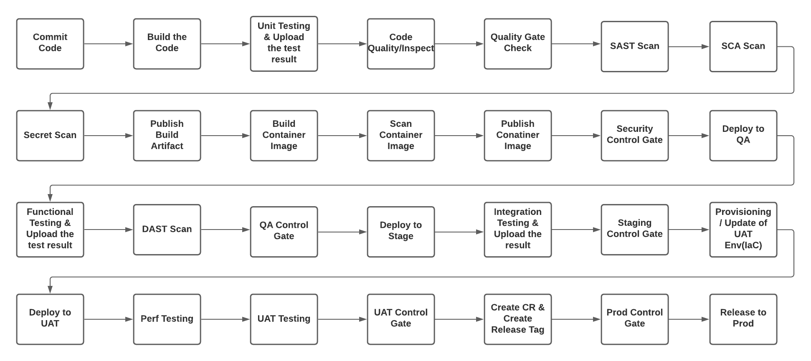	

Sample release workflow implementation using [Github Action](https://github.com/features/actions) is present [here](https://github.com/judebantony/cicd-github-action-example/tree/main/.github/workflows/workflow.yml)

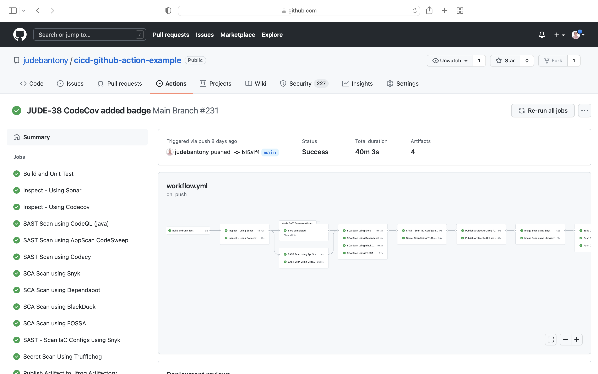
	
Sample release workflow execution is present [here](https://github.com/judebantony/cicd-github-action-example/actions/runs/1500211427)	

## Jira and Github Integration - (Planning,Requirement & Test Execution) ##
Jira and Github Integration will provide better traceability between Planning, Requirement, Code, Build and Test Execution.  [Linking your GitHub to Jira](https://support.atlassian.com/jira-cloud-administration/docs/integrate-with-github/) gives team the ability to see their branches, commit messages, build, test cases & results, pull requests and release information in the context of Jira tickets. More information can find [here.](https://github.blog/2018-10-04-announcing-the-new-github-and-jira-software-cloud-integration/)

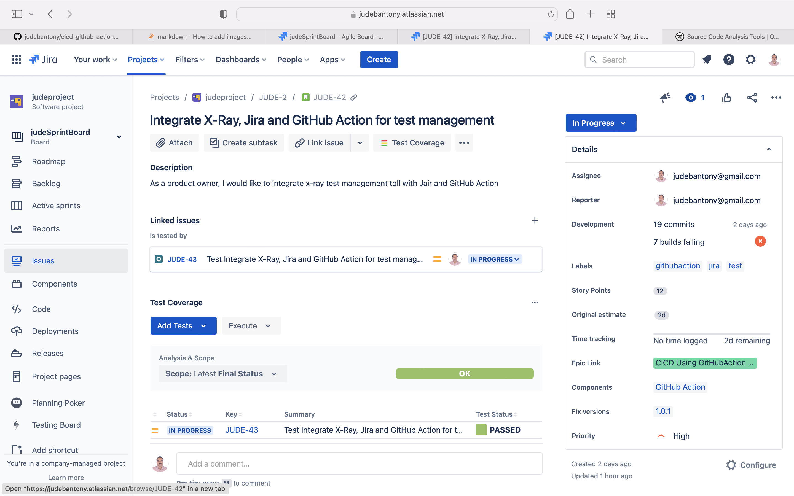

When a developer makes a commit, they should add a Jira issue key to the commit message as shown below:

```json
git commit -m "JUDE-42 add a README file to the project."
git push origin <branchname>
```

Then GitHub Commit information would appear in Jira as shown below.
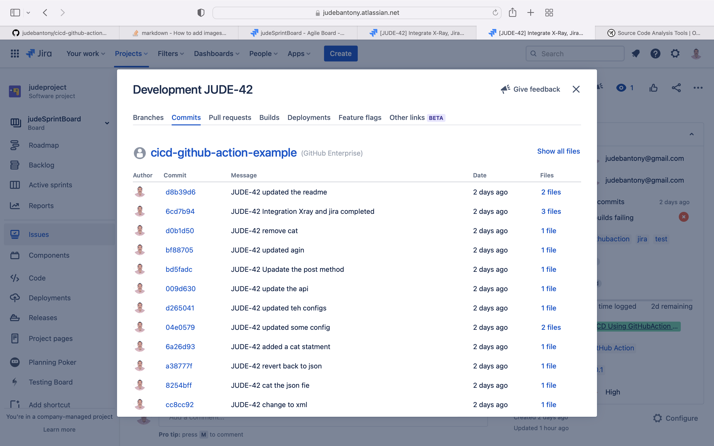

Once GitHub Action build is completed, build information get reflected in Jira as shown below.

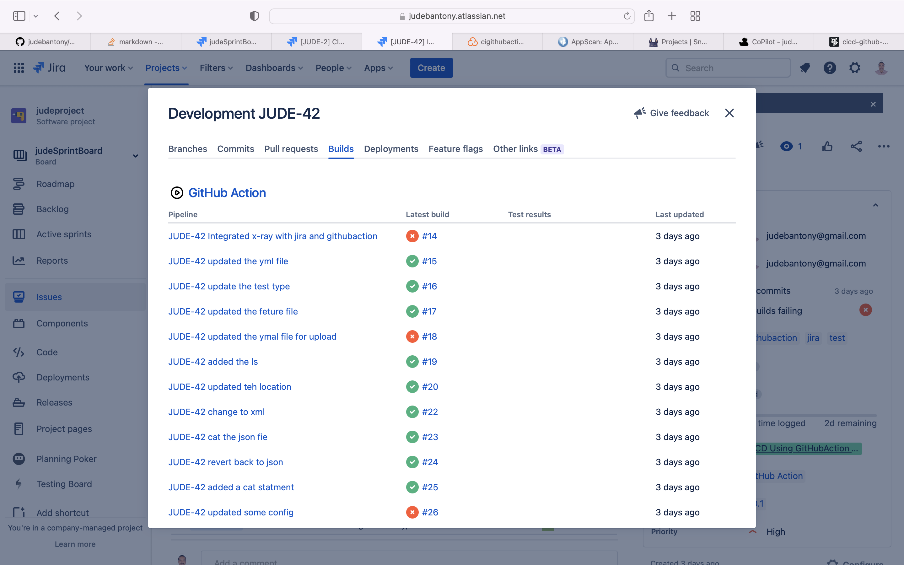

Using Cucumber & Gherkin, we can add Test Plan & Test Cases to a specific story in Jira.

```java
Feature: Test Health Check Rest API
  Scenario: Health Check Api call is successful 

    Given user wants to call health check api
    When user call health check api with the url "http://35.194.14.180/api/v1"
    Then return result
```

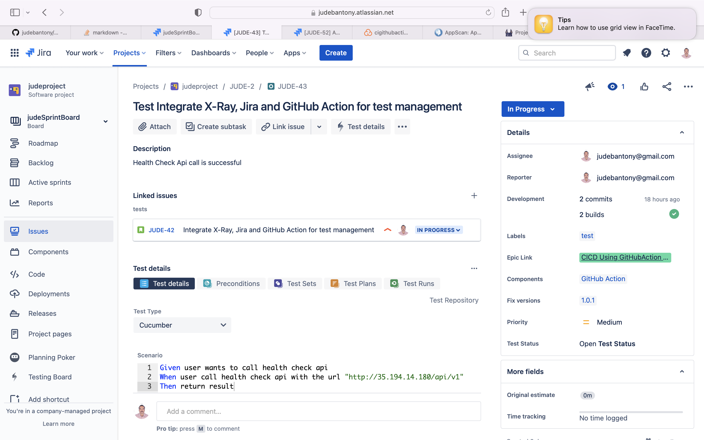

Test results will be uploaded back to Jira to provide [Requirement Traceability Matrix](https://www.tutorialspoint.com/software_testing_dictionary/requirements_traceability_matrix.htm)

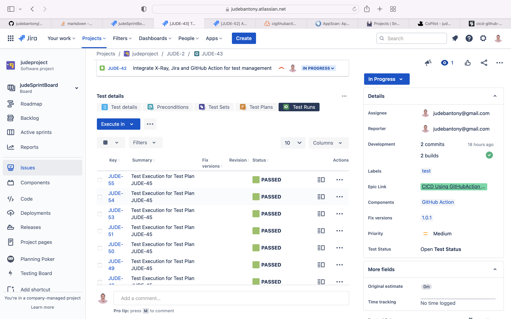


## Integrating Cloud SaaS DevSecOps tools using GitHub Action ##
Integration & Implementation of E2E CI/CD release workflow using [Github Action](https://github.com/features/actions), this has been achieved using different Cloud SaaS tools listed below.

### 1) Maven - Build and Unit Test ###
[Apache Maven](https://maven.apache.org) is a software project management and comprehension tool. Based on the concept of a project object model (POM), Maven can manage a project's build, reporting and documentation from a central piece of information.

Code is build using [Maven](https://maven.apache.org) and unit test cases are executed using [JUnit](https://junit.org/junit5/)
The test coverage result, which is aggregated by [Jacoco](https://www.baeldung.com/sonarqube-jacoco-code-coverage) would be uploaded to [Github Action](https://github.com/features/actions) as artifacts. Please check [pom.xml](https://github.com/judebantony/cicd-github-action-example/tree/main/pom.xml) as well. 

```yaml

  test:
    name: Build and Unit Test
    runs-on: ubuntu-latest
    
    steps:
      - name: Check out the code
        uses: actions/checkout@v1
        with:
          fetch-depth: 0
      - name: Set up JDK
        uses: actions/setup-java@v1
        with:
          java-version: 1.8
      - name: Cache Maven packages
        uses: actions/cache@v1
        with:
          path: ~/.m2
          key: ${{ runner.os }}-m2-${{ hashFiles('**/pom.xml') }}
          restore-keys: ${{ runner.os }}-m2     
      - name: Build
        run: mvn -B clean package -DskipTests
      - name: Run UnitTest and Verify 
        run: mvn -B verify -DexcludedGroups="Smoke | Staging | BrowserStack | LamdaTest"
      - name: Generate JaCoCo Badge
        id: jacoco
        uses: cicirello/jacoco-badge-generator@v2
      - name: Log code coverage percentage
        run: |
          echo "coverage = ${{ steps.jacoco.outputs.coverage }}"
          echo "branch coverage = ${{ steps.jacoco.outputs.branches }}"
      - name: Upload code coverage report
        uses: actions/upload-artifact@v2
        with:
          name: jacoco-report
          path: target/site/jacoco/
      - name: Adding Junit Report
        uses: ashley-taylor/junit-report-annotations-action@master
        if: always()
        with:
          access-token: ${{ secrets.GITHUB_TOKEN }}          
      - name: Publish Unit Test Results
        uses: EnricoMi/publish-unit-test-result-action/composite@v1
        with:
           files: target/surefire-reports/*.xml

```
Sample test result:- 


### 2) SonarQube Cloud - Code Quality ###
[SonarQube](https://www.sonarqube.org) is an open-source platform developed by SonarSource for continuous inspection of code quality to perform automatic reviews with static analysis of code to detect bugs, code smells, and security vulnerabilities on 20+ programming languages.

Inspect the code using [SonarQube](https://www.sonarqube.org) and enable the Quality Gate Check in CI/CD workflow. 
Results are uploaded to [SonarQube](https://www.sonarqube.org) Cloud SaaS offering. 

```yaml
  sonar:
    name: Inspect - Using Sonar
    runs-on: ubuntu-latest
    needs: [test]
    
    steps:
      - name: Check out the code
        uses: actions/checkout@v1
        with:
          fetch-depth: 0
      - name: Set up JDK 11
        uses: actions/setup-java@v1
        with:
          java-version: 11
      - name: Cache SonarCloud packages
        uses: actions/cache@v1
        with:
          path: ~/.sonar/cache
          key: ${{ runner.os }}-sonar
          restore-keys: ${{ runner.os }}-sonar
      - name: Cache Maven packages
        uses: actions/cache@v1
        with:
          path: ~/.m2
          key: ${{ runner.os }}-m2-${{ hashFiles('**/pom.xml') }}
          restore-keys: ${{ runner.os }}-m2     
      - name: Build and analyze
        env:
          GITHUB_TOKEN: ${{ secrets.GITHUB_TOKEN }}
          SONAR_TOKEN: ${{ secrets.SONAR_TOKEN }}
        run: mvn -B verify -DexcludedGroups="Smoke | Staging | LamdaTest | BrowserStack" org.sonarsource.scanner.maven:sonar-maven-plugin:sonar -Dsonar.issuesReport.html.enable=true -Dsonar.projectKey=judebantony_cicd-github-action-example
      - name: SonarQube Quality Gate check
        uses: sonarsource/sonarqube-quality-gate-action@master
        env:
          GITHUB_TOKEN: ${{ secrets.GITHUB_TOKEN }}
          SONAR_TOKEN: ${{ secrets.SONAR_TOKEN }}   
        timeout-minutes: 5     
        with:
          scanMetadataReportFile: target/sonar/report-task.txt     

```
SonarQube dashbord:-
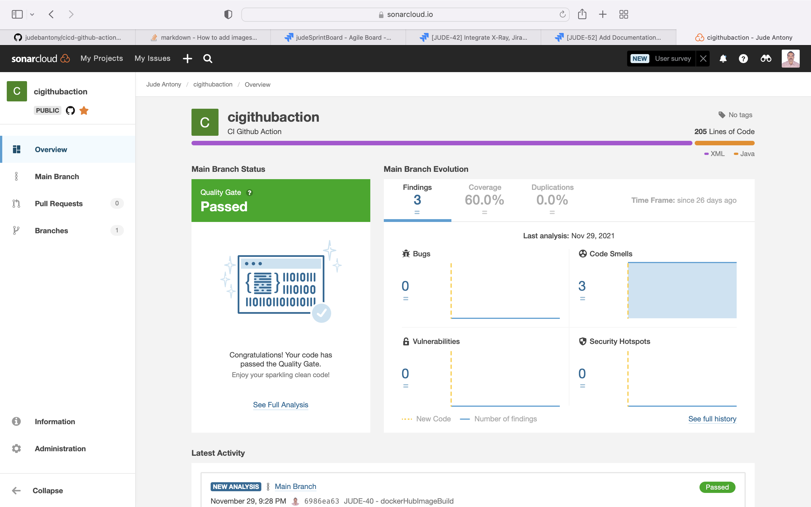
Quality Gate Check:-
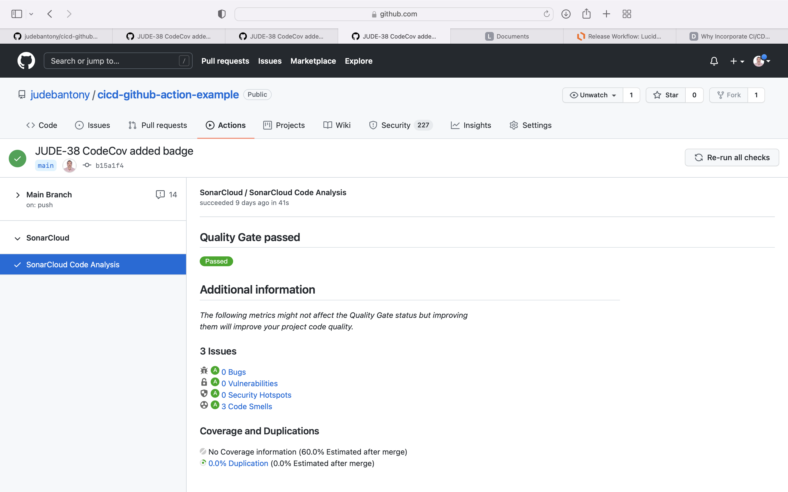

### 3) Codecov - Code Coverage ###
[Codecov](https://about.codecov.io) improve code quality and workflow with highly integrated tools to group, merge, archive, and compare coverage reports.

Uploaded the code coverage result to [Codecov](https://about.codecov.io) Cloud SaaS offering.

```yaml
  codecov:
    name: Inspect - Using Codecov
    runs-on: ubuntu-latest
    needs: [test]
    
    steps:
      - name: Check out the code
        uses: actions/checkout@v1
        with:
          fetch-depth: 0
      - name: Set up JDK 8
        uses: actions/setup-java@v1
        with:
          java-version: 1.8
      - name: Cache Maven packages
        uses: actions/cache@v1
        with:
          path: ~/.m2
          key: ${{ runner.os }}-m2-${{ hashFiles('**/pom.xml') }}
          restore-keys: ${{ runner.os }}-m2     
      - name: Build and analyze
        env:
          GITHUB_TOKEN: ${{ secrets.GITHUB_TOKEN }}
          SONAR_TOKEN: ${{ secrets.SONAR_TOKEN }}
        run: mvn -B verify -DexcludedGroups="Smoke | Staging | LamdaTest | BrowserStack" cobertura:cobertura
      - name: Upload coverage to Codecov
        uses: codecov/codecov-action@v2
        with:
          token: ${{ secrets.CODECOV_TOKEN }} 
          flags: unittests 
          name: codecov-umbrella 
          fail_ci_if_error: true 
          verbose: true     

```
CodeCov dashboard:-
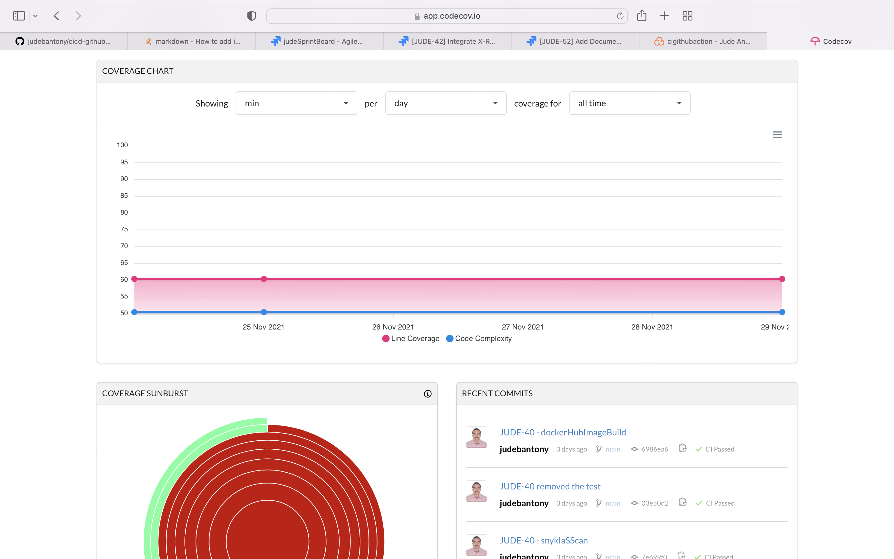


### 4) CodeQL - SAST ###
[CodeQL](https://codeql.github.com) is the code analysis engine developed by GitHub to automate security checks. You can analyze your code using CodeQL and display the results as code scanning alerts.

Use the native Github Action [CodeQL](https://codeql.github.com) for SAST scan and upload the result to [GitHub Advanced Security](https://github.com/security) tab.

```yaml
  codeqlScan:
      name: SAST Scan using CodeQL
      runs-on: ubuntu-latest
      needs: [sonar, codecov]
      
      permissions:
        actions: read
        contents: read
        security-events: write
      strategy:
        fail-fast: false
        matrix:
          language: [ 'java' ]
          
      steps:
      - name: Checkout repository
        uses: actions/checkout@v2
        with:
           fetch-depth: 0
      - name: Initialize CodeQL
        uses: github/codeql-action/init@v1
        with:
          languages: ${{ matrix.language }}
      - name: Autobuild
        uses: github/codeql-action/autobuild@v1
      - name: Perform CodeQL Analysis
        uses: github/codeql-action/analyze@v1

```
GitHub Advanced Security Tab:-
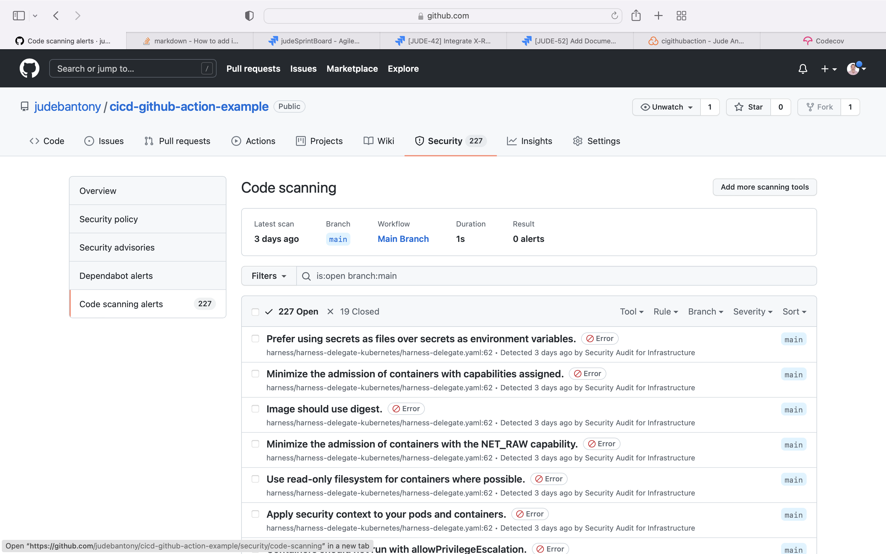

### 5) AppScan CodeSweep - SAST ###
[HCL AppScan CodeSweep](https://www.hcltechsw.com/appscan/codesweep) is a free to use security tool, designed for beginners and professionals alike, who need a quick, simple, and platform friendly program.

Use the [AppScan CodeSweep](https://www.hcltechsw.com/appscan/codesweep) for SAST scan and upload the result to [GitHub Advanced Security](https://github.com/security) tab using sairf [OWASP](https://owasp.org/www-community/Source_Code_Analysis_Tools) format.


```yaml
  appScan:
    name: SAST Scan using AppScan CodeSweep
    runs-on: ubuntu-latest
    needs: [sonar, codecov]
    
    steps:
      - name: Checkout repository
        uses: actions/checkout@v2
        with:
           fetch-depth: 0
      - name: Run AppScan CodeSweep
        uses: HCL-TECH-SOFTWARE/appscan-codesweep-action@v1
        with:
            asoc_key: ${{secrets.ASOC_KEY}}
            asoc_secret: ${{secrets.ASOC_SECRET}}
        env: 
          GITHUB_TOKEN: ${{secrets.GITHUB_TOKEN}}
```
HCL AppScan CodeSweep dashboard:-
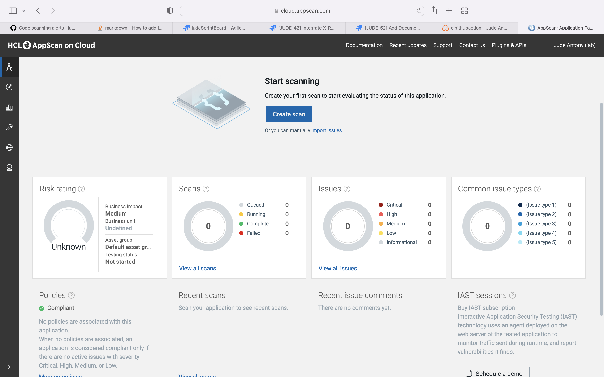

### 6) Codacy - SAST  ###
[Codacy](https://www.codacy.com) automatically analyzes your source code and identifies issues as you go, helping you develop software more efficiently with fewer issues down the line. Through static code review analysis, Codacy notifies you of security issues, code coverage, code duplication, and code complexity in every commit and pull request.

Use the [Codacy](https://www.codacy.com) for SAST scan and upload the result to [GitHub Advanced Security](https://github.com/security) tab using sairf [OWASP](https://owasp.org/www-community/Source_Code_Analysis_Tools) format.

```yaml
  codacyScan:
      name: SAST Scan using Codacy
      runs-on: ubuntu-latest
      needs: [sonar, codecov]
      
      steps:
        - uses: actions/checkout@v2
          with:
            fetch-depth: 0
        - name: Run Codacy Analysis CLI
          uses: codacy/codacy-analysis-cli-action@master
          with:
            output: codacy.sarif
            format: sarif
            gh-code-scanning-compat: true
            max-allowed-issues: 2147483647
        
        - name: Upload SARIF results file
          uses: github/codeql-action/upload-sarif@main
          with:
            sarif_file: codacy.sarif          
```
Codacy dashboard.
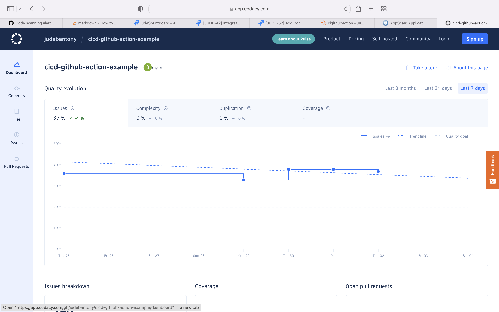

### 7) Snyk - SCA  ###
[Snyk](https://snyk.io) (pronounced sneak) is a developer security platform for securing code, dependencies, containers, and infrastructure as code.

Use the [Snyk](https://snyk.io) for SCA scan and upload the result to [GitHub Advanced Security](https://github.com/security) tab using sairf [OWASP](https://owasp.org/www-community/Source_Code_Analysis_Tools) format.

```yaml
  snykScan:
      name: SCA Scan using Snyk
      runs-on: ubuntu-latest
      needs: [codeqlScan, codacyScan, appScan]
          
      steps:
      - uses: actions/checkout@v2
        with:
          fetch-depth: 0
      - name: Set up Maven
        run: mvn -N io.takari:maven:wrapper -Dmaven=3.8.2
      - name: Run Snyk to check for vulnerabilities
        continue-on-error: true      
        uses: snyk/actions/maven-3-jdk-11@master
        env:
           SNYK_TOKEN: ${{ secrets.SNYK_TOKEN }}
        with:
          args: --sarif-file-output=snyk.sarif
      - name: Upload result to GitHub Code Scanning
        uses: github/codeql-action/upload-sarif@v1
        with:
          sarif_file: snyk.sarif

```
Snyk dashboard:-


### 8) Dependabot - SCA  ###
Use the github native [Dependabot](https://docs.github.com/en/code-security/supply-chain-security/managing-vulnerabilities-in-your-projects-dependencies/configuring-dependabot-security-updates) for SCA scan and upload the result to [GitHub Advanced Security](https://github.com/security) tab.

```yaml dependabot.yml

version: 2
updates:
  - package-ecosystem: "maven"
    directory: "/" 
    schedule:
      interval: "daily"
  - package-ecosystem: "docker"
    directory: "/"
    schedule:
      interval: "weekly"

```
Dependabot dashboard:-
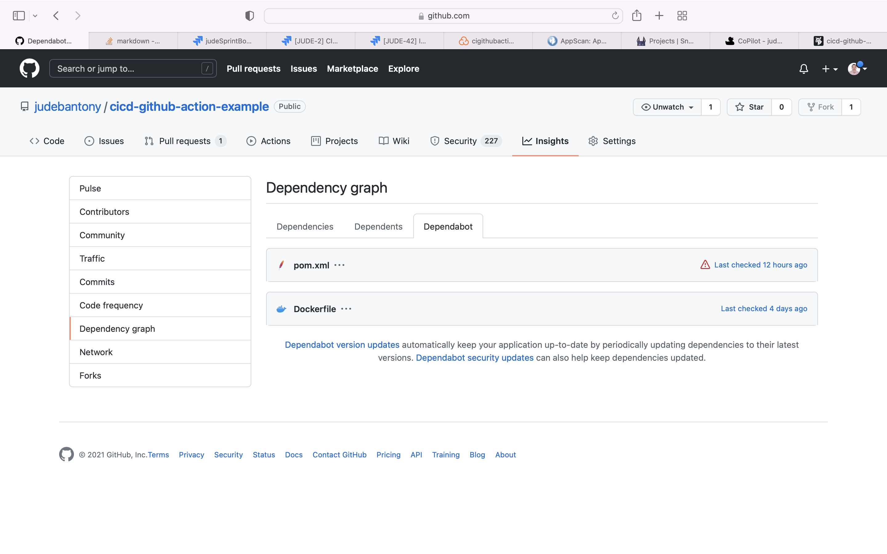

### 9) BlackDuck CoPilot - SCA  ###
[Black Duck](https://www.blackducksoftware.com) is a complete open source management solution, which fully discovers all open source in your code. It can map components to known vulnerabilities, and identify license and component quality risks.

Use the [Black Duck](https://www.blackducksoftware.com) for SCA scan and upload the result to [GitHub Advanced Security](https://github.com/security) tab using sairf [OWASP](https://owasp.org/www-community/Source_Code_Analysis_Tools) format.

```yaml 

  blackduck:
      name: SCA Scan using BlackDuck
      runs-on: ubuntu-latest
      needs: [codeqlScan, codacyScan, appScan] 

      steps:
        - name: Check out the code
          uses: actions/checkout@v2
          with:
            fetch-depth: 0
        - name: Set up JDK
          uses: actions/setup-java@v1
          with:
            java-version: 1.8
        - name: Set up Maven
          run: mvn -N io.takari:maven:wrapper -Dmaven=3.8.2
        - name: Build with Maven
          run: |
            mvn install -DskipTests=true -Dmaven.javadoc.skip=true -B -V
            mvn test -B
        - name: Upload to CoPilot
          run: bash <(curl -s https://copilot.blackducksoftware.com/ci/githubactions/scripts/upload)


```
BlackDuck CoPilot dashboard-
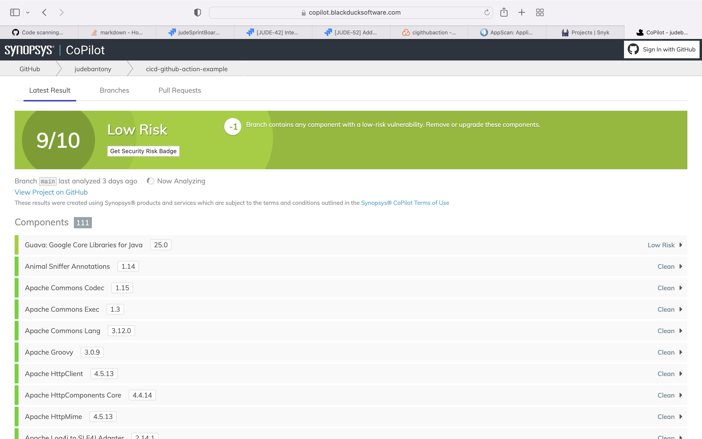

### 10) FOSSA - SCA  ###
[FOSSA](https://fossa.com/variant/homepage) accelerate open source adoption with scalable, end-to-end management for third-party code, license compliance and vulnerabilities.

Use the [FOSSA](https://fossa.com/variant/homepage) for SCA scan and upload the result to [GitHub Advanced Security](https://github.com/security) tab using sairf [OWASP](https://owasp.org/www-community/Source_Code_Analysis_Tools) format.

```yaml 

  fossaScan:
      name: SCA Scan using FOSSA
      runs-on: ubuntu-latest
      needs: [codeqlScan, codacyScan, appScan]  
      
      steps:
        - name: Check out the code
          uses: actions/checkout@v2
          with:
            fetch-depth: 0
        - name: Run FOSSA Scan
          uses: fossas/fossa-action@v1
          with:
            api-key: ${{secrets.FOSSA_APIKEY}}


```
FOSSA dashboard:-
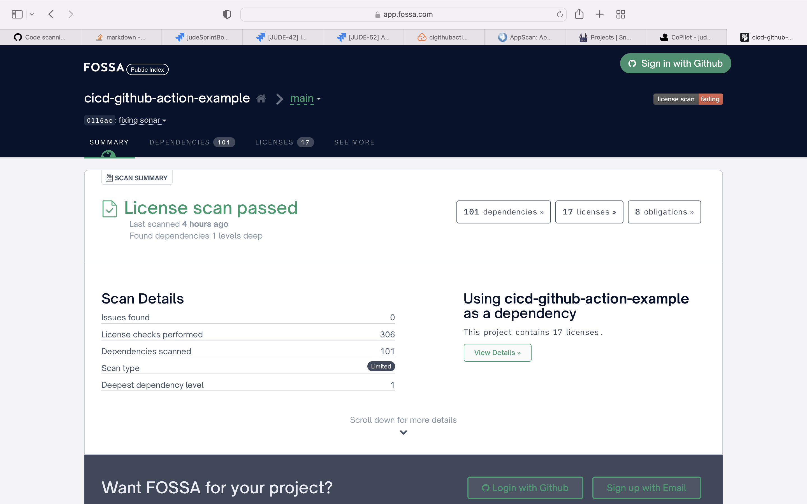

### 11) ShiftLeft - SCA & SAST ###
[ShiftLeft](https://www.shiftleft.io) provides an early, accurate picture of risk so devs can quickly secure code and stay focused on the transformation. 

Use the [ShiftLeft](https://www.shiftleft.io) for SCA & SAST scan and upload the result to [GitHub Advanced Security](https://github.com/security) tab using sairf [OWASP](https://owasp.org/www-community/Source_Code_Analysis_Tools) format.

```yaml 

   shitLeftScan:
      name: SAST and SCA Scan using ShiftLeft
      runs-on: ubuntu-latest
      needs: [codeqlScan, codacyScan, appScan, rest-api-static-security-testing]
      steps:
      - uses: actions/checkout@v2
      - name: Perform Scan
        uses: ShiftLeftSecurity/scan-action@39af9e54bc599c8077e710291d790175c9231f64
        env:
          WORKSPACE: ""
          GITHUB_TOKEN: ${{ secrets.GITHUB_TOKEN }}
          SCAN_AUTO_BUILD: true
        with:
          output: reports
      - name: Upload report
        uses: github/codeql-action/upload-sarif@v1
        with:
          sarif_file: reports


```
ShiftLeft dashboard:-
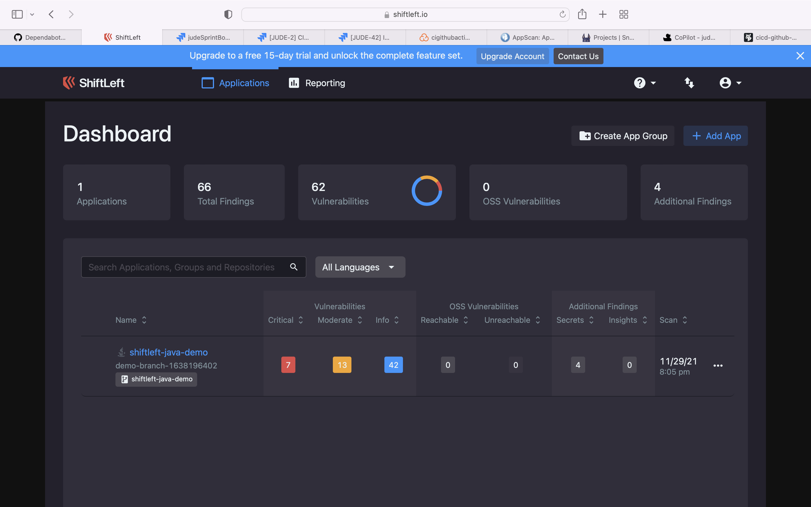

### 12) Snyk - Infrastructure as Code Scan ###
[Snyk](https://snyk.io) (pronounced sneak) is a developer security platform for securing code, dependencies, containers, and infrastructure as code.

Use [Snyk](https://snyk.io) to secure the [Infrastructure as Code Files](https://github.com/judebantony/cicd-github-action-example/tree/main/manifests).

```yaml 

  snykIaSScan:
      name: SAST - Scan IaC Configs using Snyk
      runs-on: ubuntu-latest
      needs: [dependabot, snykScan, blackduck, fossaScan]
      
      steps:
        - name: Check out the code
          uses: actions/checkout@v2
          with:
            fetch-depth: 0
        - name: Run Snyk to check configuration files for security issues
          continue-on-error: true
          uses: snyk/actions/iac@master
          env:
            SNYK_TOKEN: ${{ secrets.SNYK_TOKEN }}
          with:
            file: |
              manifests/deployment.yml
              manifests/service.yml
        - name: Upload result to GitHub Code Scanning
          uses: github/codeql-action/upload-sarif@v1
          with:
            sarif_file: snyk.sarif


```
Snyk dashboard:-


### 13) OPA - Infrastructure as Code Scan ###

The [Open Policy Agent](https://www.openpolicyagent.org/docs/latest/)  (OPA, pronounced “oh-pa”) is an open source, general-purpose policy engine that unifies policy enforcement across the stack. OPA provides a high-level declarative language that lets you specify policy as code and simple APIs to offload policy decision-making from your software. You can use OPA to enforce policies in microservices, Kubernetes, CI/CD pipelines, API gateways, and more.

Use [OPA](https://www.openpolicyagent.org/docs/latest/) to scan the [Infrastructure as Code Files](https://github.com/judebantony/cicd-github-action-example/tree/main/manifests) using [OPA Policies](https://github.com/judebantony/cicd-github-action-example/tree/main/opa-policies).

```yaml 

 opa-test:
    name: SAST - Scan IaC Configs Using OPA
    runs-on: ubuntu-latest
    needs: [dependabot, snykScan, blackduck, fossaScan, shitLeftScan]
    
    steps:
        - name: Checkout
          uses: actions/checkout@v2
          with:
            fetch-depth: 0
        - name: OPA-Test manifests standards.
          uses: ameydev/ci-cd-standards-using-opa@master
          env:
            MANIFESTS_PATH_PATTERN: manifests/
            LIBRARY_PATH: opa-policies/
            DATA: data.kubernetes.admission.deny  

```
OPA result:-
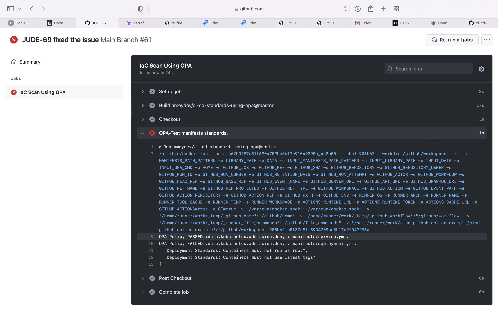


### 14) Trufflehog - Secret Scan ###

[Trufflehog](https://trufflesecurity.com/trufflehog) runs behind the scenes to scan your environment for secrets like private keys and credentials, so you can protect your data before a breach occurs.

Use [Trufflehog](https://trufflesecurity.com/trufflehog) to find any secrets present in the source code. 
 
```yaml 

  trufflehogScan:
      name: Secret Scan Using Trufflehog
      runs-on: ubuntu-latest
      needs: [dependabot, snykScan, blackduck, fossaScan]
      
      steps:
        - name: Check out the code
          uses: actions/checkout@v2
          with:
            fetch-depth: 0
        - name: trufflehog-actions-scan
          uses: edplato/trufflehog-actions-scan@master
          with:
            scanArguments: "--regex --entropy=False --max_depth=5" 


```
### 15) GitGuardian - Secret Scan ###
[GitGuardian](https://www.gitguardian.com) is a developers-first solution scanning GitHub activity in real-time for API secret tokens, database credentials, certificates.

Use [GitGuardian](https://www.gitguardian.com) to find any secrets present in the source code. Github integration with GitGuardian is present [here](https://docs.gitguardian.com/internal-repositories-monitoring/integrations/ci_cd_integrations/github_actions).
 
```yaml 

 gitguardian:
      name: Secret Scan Using GitGuardian
      runs-on: ubuntu-latest
      needs: [dependabot, snykScan, blackduck, fossaScan, shitLeftScan]
      steps:
        - name: Checkout
          uses: actions/checkout@v2
          with:
            fetch-depth: 0
        - name: GitGuardian scan
          uses: GitGuardian/ggshield-action@master
          with:
            args: -v --all-policies
          env:
            GITHUB_PUSH_BEFORE_SHA: ${{ github.event.before }}
            GITHUB_PUSH_BASE_SHA: ${{ github.event.base }}
            GITHUB_PULL_BASE_SHA: ${{ github.event.pull_request.base.sha }}
            GITHUB_DEFAULT_BRANCH: ${{ github.event.repository.default_branch }}
            GITGUARDIAN_API_KEY: ${{ secrets.GITGUARDIAN_API_KEY }}   


```
GitGuardian dashboard:-
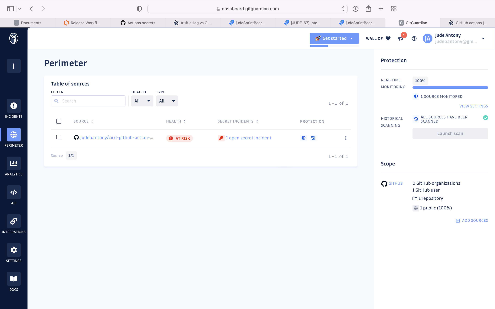

### 16) Snyk - Container Image Scan ###
[Snyk](https://snyk.io) (pronounced sneak) is a developer security platform for securing code, dependencies, containers, and infrastructure as code.

Use [Snyk](https://snyk.io) to perform container image scan. 

```yaml 

snykImageScan:
      name: Image Scan using Snyk
      runs-on: ubuntu-latest
      needs: [jfrogArtifactPush, gitHubPakageArtifactPush]  
          
      steps:
      - name: Check out the code
        uses: actions/checkout@v1
        with:
          fetch-depth: 0
      - name: Set up JDK 8
        uses: actions/setup-java@v1
        with:
          java-version: 1.8
      - name: Cache Maven packages
        uses: actions/cache@v1
        with:
          path: ~/.m2
          key: ${{ runner.os }}-m2-${{ hashFiles('**/pom.xml') }}
          restore-keys: ${{ runner.os }}-m2
      - name: Package
        run: mvn -B clean package -DskipTests
      - name: Build a Docker image
        run: docker build -t your/image-to-test .
      - name: Run Snyk to check Docker image for vulnerabilities
        continue-on-error: true
        uses: snyk/actions/docker@master
        env:
          SNYK_TOKEN: ${{ secrets.SNYK_TOKEN }}
        with:
          image: your/image-to-test
          args: --sarif-file-output=snyk.sarif --file=Dockerfile
      - name: Upload result to GitHub Code Scanning
        uses: github/codeql-action/upload-sarif@v1
        with:
          sarif_file: snyk.sarif     


```
Snyk dashboard:-


### 17) Jfrog Artifactory - Publish Artifact(jar) ###

[Jfrog Artifactory](https://jfrog.com/) is the only Universal Repository Manager supporting all major packaging formats, build tools and CI servers.

Publish the Jar to [Jfrog Artifactory](https://jfrog.com/start-free/?utm_source=google&utm_medium=cpc&utm_campaign=14808689020&utm_term=jfrog+artifactory&utm_network=g&cq_plac=&cq_plt=gp&gclid=CjwKCAiAhreNBhAYEiwAFGGKPHkjlShpTBfbPyMgP1l5hGLeiezWo9xCn-3ncNVZCudxMzCdNUhMDhoCIDIQAvD_BwE).

```yaml 

 jfrogArtifactPush:
    name: Publish Artifact to Jfrog Artifactory
    runs-on: ubuntu-latest
    needs: [snykIaSScan, trufflehogScan] 
    
    steps:
      - name: Check out the code
        uses: actions/checkout@v1
        with:
          fetch-depth: 0
      - name: Set up JDK 8
        uses: actions/setup-java@v1
        with:
          java-version: 1.8
      - name: Cache Maven packages
        uses: actions/cache@v1
        with:
          path: ~/.m2
          key: ${{ runner.os }}-m2-${{ hashFiles('**/pom.xml') }}
          restore-keys: ${{ runner.os }}-m2
      - name: Package
        run: mvn -B clean package -DskipTests
      - name: Publish JFrog Artifact
        uses: advancedcsg-open/action-jfrog-cli@master
        with:
          url: 'https://judebantony.jfrog.io/artifactory'
          credentials type: 'username'
          user: ${{ secrets.ARTIFACTORY_USER }}
          password: ${{ secrets.ARTIFACTORY_PASSWORD }}
          args: u "target/*.jar" "/libs-snapshot-repo-libs-release-local" --recursive=true  


```
Jfrog Artifactory UI:-
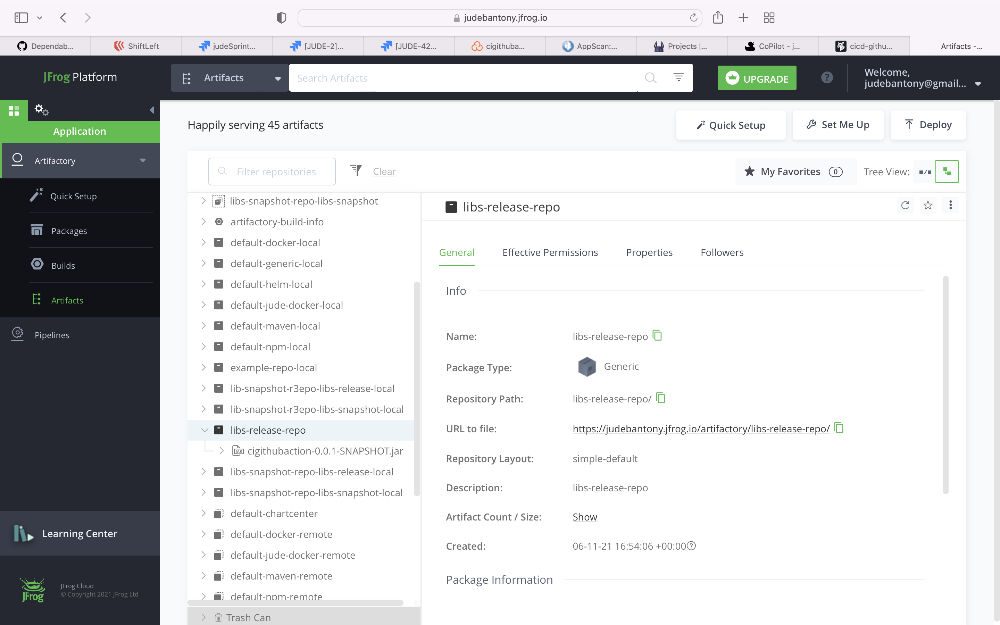

### 18) GitHub Package - Publish Artifact(jar) ###

[Github Packages](https://docs.github.com/en/packages/learn-github-packages/introduction-to-github-packages) is a software package hosting service that allows you to host your software packages privately or publicly and use packages as dependencies in your projects.

Publish the Jar to [Github Packages](https://docs.github.com/en/packages/learn-github-packages/introduction-to-github-packages).

```yaml 

 gitHubPakageArtifactPush:
    name: Publish Artifact to GitHub Package
    runs-on: ubuntu-latest 
    needs: [snyIaSScan, trufflehogScan] 
    permissions: 
      contents: read
      packages: write 
      
    steps:
      - name: Check out the code
        uses: actions/checkout@v1
        with:
          fetch-depth: 0
      - name: Set up JDK 8
        uses: actions/setup-java@v1
        with:
          java-version: 1.8
      - name: Cache Maven packages
        uses: actions/cache@v1
        with:
          path: ~/.m2
          key: ${{ runner.os }}-m2-${{ hashFiles('**/pom.xml') }}
          restore-keys: ${{ runner.os }}-m2
      - name: Publish package
        run: mvn --batch-mode deploy -DskipTests
        env:
          GITHUB_TOKEN: ${{ secrets.GITHUB_TOKEN }}


```
GitHub Package UI:-
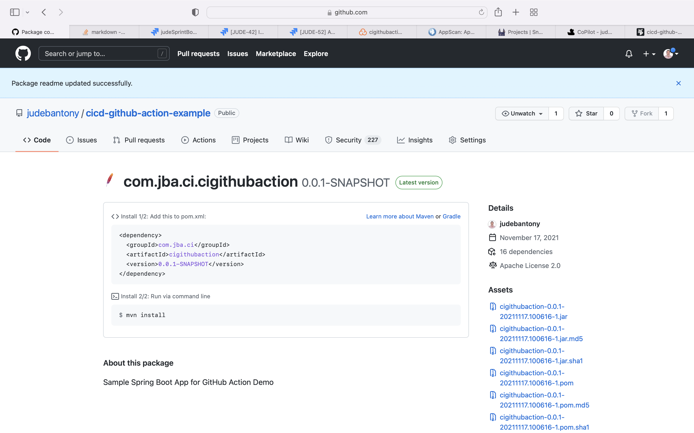

### 19) JFrog Artifactory - Build Docker Image and Publish ###

[Jfrog Artifactory](https://jfrog.com/) is the only Universal Repository Manager supporting all major packaging formats, build tools and CI servers.

Publish the Container Image to [Jfrog Artifactory](https://jfrog.com/start-free/?utm_source=google&utm_medium=cpc&utm_campaign=14808689020&utm_term=jfrog+artifactory&utm_network=g&cq_plac=&cq_plt=gp&gclid=CjwKCAiAhreNBhAYEiwAFGGKPHkjlShpTBfbPyMgP1l5hGLeiezWo9xCn-3ncNVZCudxMzCdNUhMDhoCIDIQAvD_BwE).

```yaml 

jfrogImageBuild:
    name: Build Docker Image and Publish to JFrog Artifactory
    runs-on: ubuntu-latest
    needs: [snykImageScan, jfrogXrayImageScan]

    steps:
      - name: Check out the code
        uses: actions/checkout@v1
        with:
          fetch-depth: 0
      - name: Set up JDK 8
        uses: actions/setup-java@v1
        with:
          java-version: 1.8
      - name: Cache Maven packages
        uses: actions/cache@v1
        with:
          path: ~/.m2
          key: ${{ runner.os }}-m2-${{ hashFiles('**/pom.xml') }}
          restore-keys: ${{ runner.os }}-m2
      - name: Package
        run: mvn -B clean package -DskipTests
      - name: Set up QEMU️
        uses: docker/setup-qemu-action@v1
      - name: Set up Docker Buildx
        uses: docker/setup-buildx-action@v1
      - name: Login to JFrog  
        uses: docker/login-action@v1
        with:
          registry: 'https://judebantony.jfrog.io'
          username: ${{ secrets.ARTIFACTORY_USER }}
          password: ${{ secrets.ARTIFACTORY_PASSWORD }}        
      - name: Build and Publish Image 
        id: docker_build
        uses: docker/build-push-action@v2
        with:
          context: .
          push: true
          tags: judebantony.jfrog.io/default-docker-local/cigithubaction:latest


```
Jfrog Artifactory Image Registry UI:-
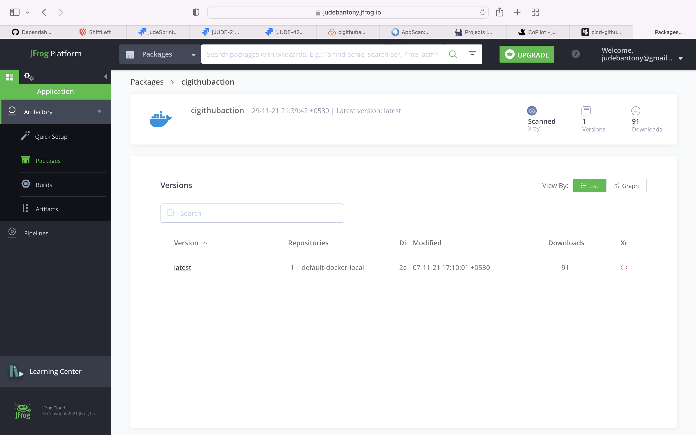

### 20) GitHub Package - Build Docker Image and Publish ###

[Github Packages](https://docs.github.com/en/packages/learn-github-packages/introduction-to-github-packages) is a software package hosting service that allows you to host your software packages privately or publicly and use packages as dependencies in your projects.

Publish the Container Image to [Github Package](https://docs.github.com/en/packages/learn-github-packages/introduction-to-github-packages).

```yaml 

gitHubPakageImageBuild:
    name: Push Docker image to GitHub Package
    runs-on: ubuntu-latest
    needs: [snykImageScan, jfrogXrayImageScan]
    permissions:
      contents: read
      packages: write

    steps:
        - name: Check out the repo
          uses: actions/checkout@v2
          with:
            fetch-depth: 0
        - name: Set up JDK 8
          uses: actions/setup-java@v1
          with:
            java-version: 1.8
        - name: Cache Maven packages
          uses: actions/cache@v1
          with:
            path: ~/.m2
            key: ${{ runner.os }}-m2-${{ hashFiles('**/pom.xml') }}
            restore-keys: ${{ runner.os }}-m2
        - name: Package
          run: mvn -B clean package -DskipTests
        - name: Set up QEMU️
          uses: docker/setup-qemu-action@v1
        - name: Set up Docker Buildx
          uses: docker/setup-buildx-action@v1

        - name: Log in to the Container registry
          uses: docker/login-action@f054a8b539a109f9f41c372932f1ae047eff08c9
          with:
            registry: https://ghcr.io
            username: ${{ github.actor }}
            password: ${{ secrets.GITHUB_TOKEN }}
  
        - name: Extract metadata (tags, labels) for Docker
          id: meta
          uses: docker/metadata-action@98669ae865ea3cffbcbaa878cf57c20bbf1c6c38
          with:
            images: ghcr.io/judebantony/cigithubaction:latest
  
        - name: ghcr.io
          uses: docker/build-push-action@ad44023a93711e3deb337508980b4b5e9bcdc5dc
          with:
            context: .
            push: true
            tags: ghcr.io/judebantony/cigithubaction:latest


```
GitHub Package Image Registry UI:-
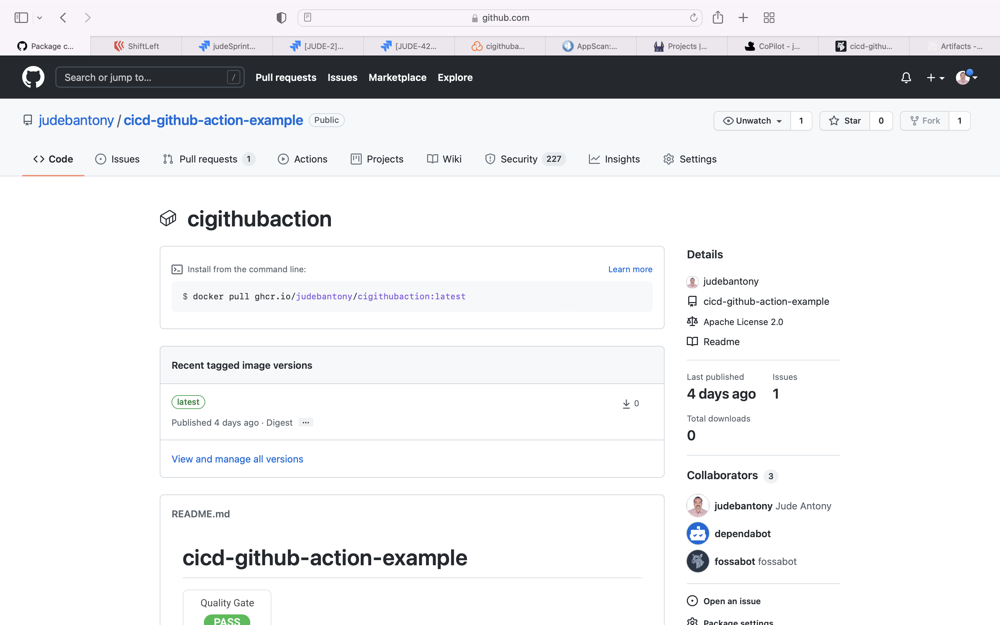

### 21) Docker Hub - Build Docker Image and Publish ###

[Docker hub](https://hub.docker.com) is the world's easiest way to create, manage, and deliver your teams' container applications.

Publish the Container Image to [Docker hub](https://hub.docker.com).

```yaml 

 dockerHubImageBuild:
      name: Push Docker image to Docker Hub
      runs-on: ubuntu-latest
      needs: [snykImageScan, jfrogXrayImageScan]
      
      steps:
        - name: Check out the repo
          uses: actions/checkout@v2
          with:
            fetch-depth: 0
        - name: Set up JDK 8
          uses: actions/setup-java@v1
          with:
            java-version: 1.8
        - name: Cache Maven packages
          uses: actions/cache@v1
          with:
            path: ~/.m2
            key: ${{ runner.os }}-m2-${{ hashFiles('**/pom.xml') }}
            restore-keys: ${{ runner.os }}-m2
        - name: Package
          run: mvn -B clean package -DskipTests
        - name: Log in to Docker Hub
          uses: docker/login-action@f054a8b539a109f9f41c372932f1ae047eff08c9
          with:
            username: ${{ secrets.DOCKER_USERNAME }}
            password: ${{ secrets.DOCKER_PASSWORD }}
        
        - name: Extract metadata (tags, labels) for Docker
          id: meta
          uses: docker/metadata-action@98669ae865ea3cffbcbaa878cf57c20bbf1c6c38
          with:
            images: docker.io/judebantony/cigithubaction
        
        - name: Build and push Docker image
          uses: docker/build-push-action@ad44023a93711e3deb337508980b4b5e9bcdc5dc
          with:
            context: .
            push: true
            tags: ${{ steps.meta.outputs.tags }}
            labels: ${{ steps.meta.outputs.labels }}


```
Docker Hub Image Registry UI:-
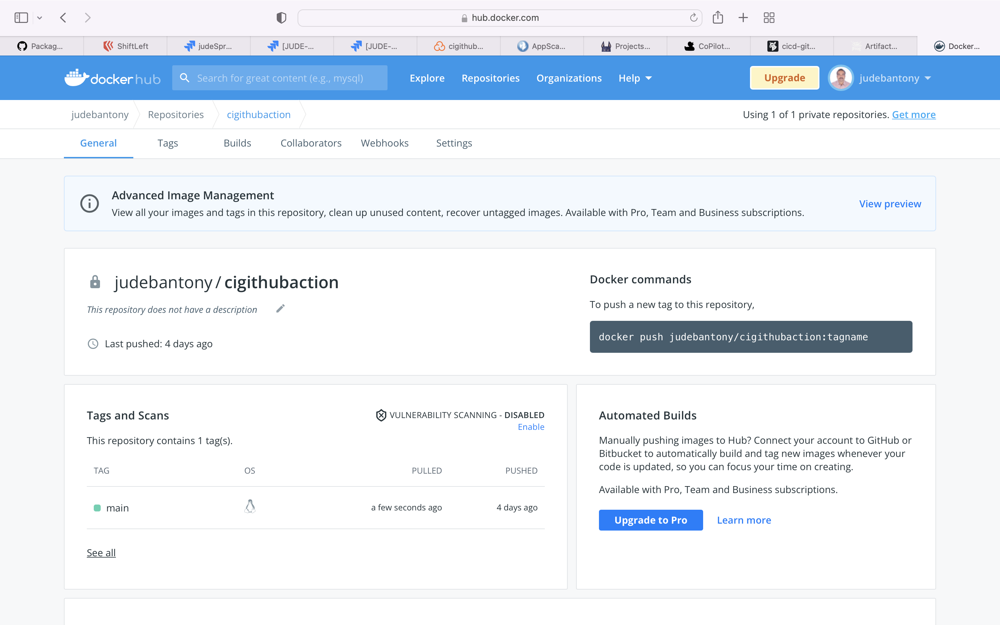

### 22) CD - Deploy to Azure AKS ###

[AKS](https://azure.microsoft.com/en-in/services/kubernetes-service/) allows you to quickly deploy a production ready [Kubernetes](https://kubernetes.io) cluster in [Azure](https://azure.microsoft.com/).

Deploy the Container image to [Azure AKS](https://azure.microsoft.com/en-in/services/kubernetes-service/) using [kubectl](https://kubernetes.io/docs/reference/kubectl/overview/) and GitHub Action, [kubeconfig](https://kubernetes.io/docs/concepts/configuration/organize-cluster-access-kubeconfig/) manifest files are available  [here](https://github.com/judebantony/cicd-github-action-example/tree/main/manifests).

```yaml 

  qadeploy:
    name: QA Deployment to AKS 
    runs-on: ubuntu-latest
    needs: [jfrogImageBuild, dockerHubImageBuild, gitHubPakageImageBuild]

    steps:
      - name: Check out the code
        uses: actions/checkout@v1
        with:
          fetch-depth: 0
      - name: Login to JFrog  
        uses: docker/login-action@v1
        with:
          registry: 'https://judebantony.jfrog.io'
          username: ${{ secrets.ARTIFACTORY_USER }}
          password: ${{ secrets.ARTIFACTORY_PASSWORD }}        
      - name: Setting AKS Context 
        uses: azure/aks-set-context@v1
        with:
          creds: ${{ secrets.AZURE_CREDENTIALS }}
          cluster-name: 'JudeAKSCluster'
          resource-group: 'DefaultResourceGroup-EUS'
      - name: Create AKS Namespace     
        run: |
            kubectl create namespace cigithubactionqa --dry-run -o json | kubectl apply -f -
      - name: Create Secret     
        uses: azure/k8s-create-secret@v1
        with:
          container-registry-url: 'https://judebantony.jfrog.io'
          container-registry-username: ${{ secrets.ARTIFACTORY_USER }}
          container-registry-password: ${{ secrets.ARTIFACTORY_PASSWORD }}
          namespace: 'cigithubactionqa'
          secret-name: 'cigithubactionqa-crd'
      - name: Deploy app to AKS 
        uses: azure/k8s-deploy@v1
        with:
          manifests: |
            manifests/deployment.yml
            manifests/service.yml
          images: |
             judebantony.jfrog.io/default-docker-local/cigithubaction:latest
          imagepullsecrets: |
            cigithubactionqa-crd   
          namespace: 'cigithubactionqa'         


```
AKS Console:-
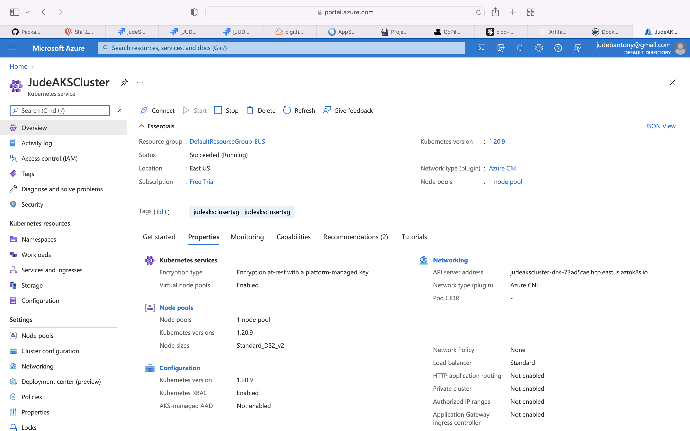

### 23) Functional Test - Using Cucumber. ###

[Cucumber](https://cucumber.io) is the world's leading tool for BDD.

Run the [Cucumber](https://cucumber.io) Test Cases and upload the result to cucumber.io and GitHub Action. The feature files are present [here](https://github.com/judebantony/cicd-github-action-example/tree/main/src/test/resources/com/jba/ci/bdd/).
 
```yaml 

  qatest:
    name: QA Validation and Report
    runs-on: ubuntu-latest
    needs: [qadeploy]
    
    steps:
      - name: Check out the code
        uses: actions/checkout@v1
        with:
          fetch-depth: 0
      - name: Set up JDK
        uses: actions/setup-java@v1
        with:
          java-version: 1.8
      - name: Cache Maven packages
        uses: actions/cache@v1
        with:
          path: ~/.m2
          key: ${{ runner.os }}-m2-${{ hashFiles('**/pom.xml') }}
          restore-keys: ${{ runner.os }}-m2     
      - name: Run Test Automation
        run: mvn -B verify -DexcludedGroups="Staging | LamdaTest | BrowserStack" -Dgroups="Smoke"
        env: 
          CUCUMBER_PUBLISH_TOKEN: ${{secrets.CUCUMBER_PUBLISH_TOKEN}}
      - name: Upload Test Automation Report
        uses: deblockt/cucumber-report-annotations-action@v1.7
        with:
          access-token: ${{ secrets.GITHUB_TOKEN }}
          path: "target/cucumber-reports/cucumber.json"
          check-status-on-error: 'neutral'
          annotation-status-on-error: 'warning'    
      - name: Upload Cucumber report
        uses: actions/upload-artifact@v2
        with:
          name: cucumber-report
          path: target/cucumber-reports/cucumber.html

```
Cucumber Report:-
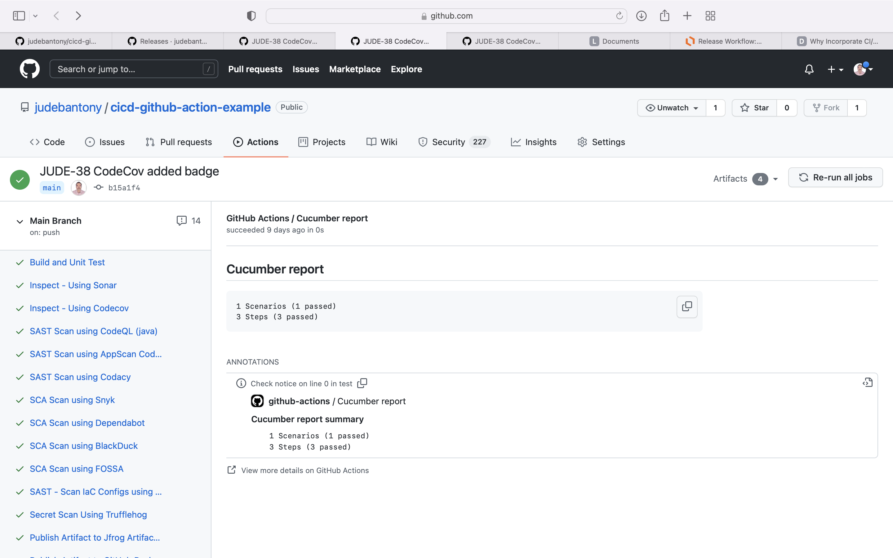

Cucumber.io Report:-
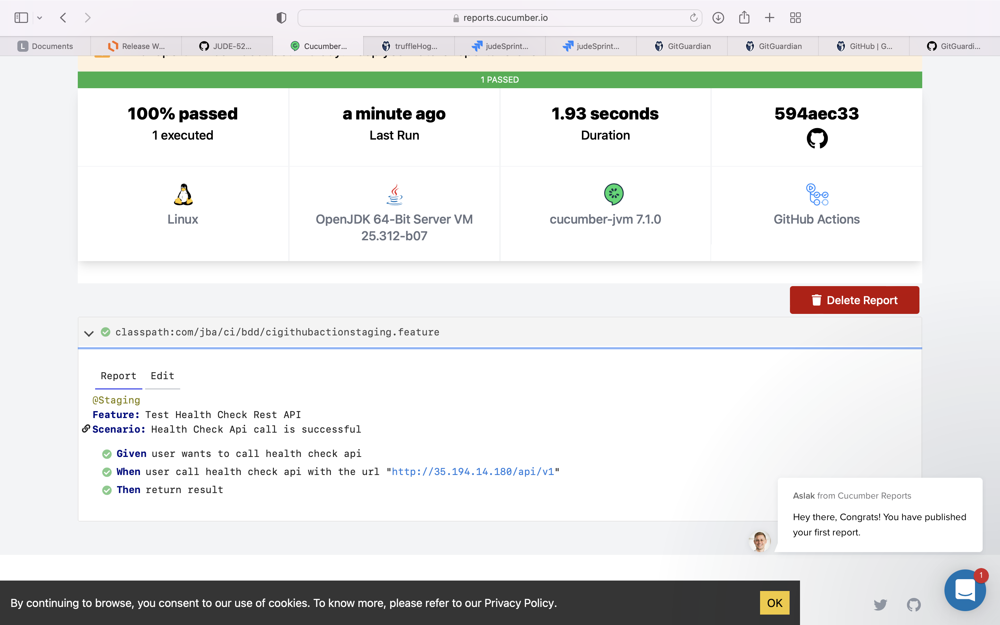

### 24) Functional UI Test - Using BrowserStack. ###
[BrowserStack](https://www.browserstack.com) is an Indian cloud web and mobile testing platform that provides developers with the ability to test their websites and mobile applications across on-demand browsers, operating systems and real mobile devices.

[Selenium](https://www.selenium.dev) is an open-source umbrella project for a range of tools and libraries aimed at supporting web browser automation. Selenium provides a playback tool for authoring functional tests without the need to learn a test scripting language.

Run the [Selenium](https://www.selenium.dev) [Cucumber](https://cucumber.io) based UI Test Cases using [BrowserStack](https://www.browserstack.com) [Selenium Grid](https://www.selenium.dev/documentation/grid/) and capture the result in their Cloud SaaS offering. The test case feature files are present [here](https://github.com/judebantony/cicd-github-action-example/tree/main/src/test/resources/com/jba/ci/bdd/).

```yaml 

  browserStackTest:
    name: 'BrowserStack QA Test Validation'
    runs-on: ubuntu-latest 
    needs: [qadeploy]
    
    steps:

      - name: 'BrowserStack Env Setup'  
        uses: browserstack/github-actions/setup-env@master
        with:
          username:  ${{ secrets.BROWSERSTACK_USERNAME }}
          access-key: ${{ secrets.BROWSERSTACK_ACCESS_KEY }}

      - name: 'BrowserStack Local Tunnel Setup' 
        uses: browserstack/github-actions/setup-local@master
        with:
          local-testing: start
          local-identifier: random

      - name: Check out the code
        uses: actions/checkout@v1
        with:
          fetch-depth: 0
      - name: Set up JDK
        uses: actions/setup-java@v1
        with:
          java-version: 1.8
      - name: Cache Maven packages
        uses: actions/cache@v1
        with:
          path: ~/.m2
          key: ${{ runner.os }}-m2-${{ hashFiles('**/pom.xml') }}
          restore-keys: ${{ runner.os }}-m2     
      - name: Run BrowserStack Test Automation
        run: mvn -B verify -DexcludedGroups="Staging | Smoke | LamdaTest" -Dgroups="BrowserStack"
        env: 
          CUCUMBER_PUBLISH_TOKEN: ${{secrets.CUCUMBER_PUBLISH_TOKEN}}

      - name: 'BrowserStackLocal Stop'  
        uses: browserstack/github-actions/setup-local@master
        with:
          local-testing: stop

```
BrowserStack dashboard:-
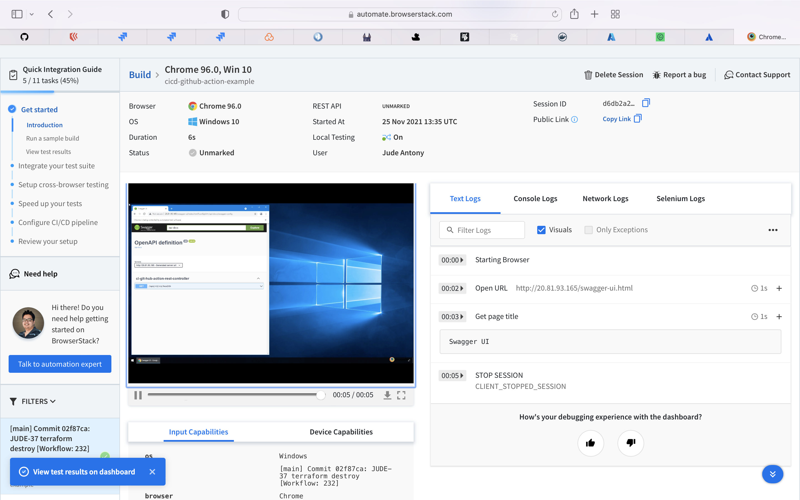

### 25) Functional UI Test - Using LamdaTest. ###

Run your [Selenium](https://www.selenium.dev) test automation scripts across online selenium grid of desktop, Android and iOS mobile browsers. Develop, test, and deliver faster every time with automated cross browser testing using LambdaTest online Automation Browser Testing Grid.

Execute the [Selenium](https://www.selenium.dev) [Cucumber](https://cucumber.io) based UI Test Cases using [LamdaTest](https://www.lambdatest.com/?fp_ref=aliakbar42) and capture the result. The feature files are present [here](https://github.com/judebantony/cicd-github-action-example/tree/main/src/test/resources/com/jba/ci/bdd/).

```yaml 

  lamdaTest:
    name: 'LamdaTest QA Test Validation'
    runs-on: ubuntu-latest 
    needs: [qadeploy]
    
    steps:
      - name: Start Tunnel
        id: tunnel
        uses: LambdaTest/LambdaTest-tunnel-action@v1
        with:
          user: ${{ secrets.LT_EMAIL }}
          accessKey: ${{ secrets.LT_ACCESS_KEY }}
          tunnelName: "testTunnel"
      - name: Check out the code
        uses: actions/checkout@v1
        with:
          fetch-depth: 0
      - name: Set up JDK
        uses: actions/setup-java@v1
        with:
          java-version: 1.8
      - name: Cache Maven packages
        uses: actions/cache@v1
        with:
          path: ~/.m2
          key: ${{ runner.os }}-m2-${{ hashFiles('**/pom.xml') }}
          restore-keys: ${{ runner.os }}-m2     
      - name: Run LamdaTest Automation
        run: mvn -B verify -DexcludedGroups="Staging | Smoke | BrowserStack" -Dgroups="LamdaTest"
        env: 
          CUCUMBER_PUBLISH_TOKEN: ${{secrets.CUCUMBER_PUBLISH_TOKEN}}
          LT_EMAIL: ${{ secrets.LT_EMAIL }}
          LT_ACCESS_KEY: ${{ secrets.LT_ACCESS_KEY }}
      - name: Export Tunnel Logs for debugging
        uses: actions/upload-artifact@v2
        with:
           name: tunnel_logs
           path: ${{ steps.tunnel.outputs.logFileName }}          

```
LambdaTest dashboard:-
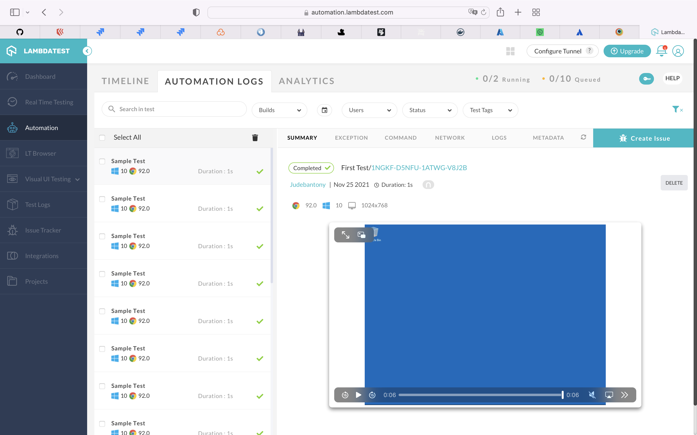

### 26) DAST Scan - Using StackHawk. ###
[StackHawk](https://www.stackhawk.com) makes it simple for developers to find, triage, and fix application security bugs. Scan your application for AppSec bugs in the code your team wrote, triage and fix with provided documentation, and automate in your pipeline to prevent future bugs from hitting prod.

Use [StackHawk](https://www.stackhawk.com) for DAST scan for all the [OpenAPI](https://swagger.io/specification/) (REST APIs). StackHawk config file is present [here](https://github.com/judebantony/cicd-github-action-example/tree/main/stackhawl.yml).

```yaml 

  stackhawkScan:
    name: DAST Scan using StackHawk
    runs-on: ubuntu-20.04
    needs: [qatest, browserStackTest, lamdaTest]

    steps:
      - name: Checkout code
        uses: actions/checkout@v2
        with:
          fetch-depth: 0
      - name: Download OpenAPI Spec
        run: |
          curl http://20.81.93.165/api-docs > openapi.json
      - name: Run HawkScan
        uses: stackhawk/hawkscan-action@v1.3.2
        continue-on-error: true
        with:
          apiKey: ${{ secrets.HAWK_API_KEY }}
          configurationFiles: stackhawk.yml
          codeScanningAlerts: true
          githubToken: ${{ secrets.GITHUB_TOKEN }}   
          environmentVariables: |
            APP_HOST
            APP_ENV
            APP_ID
        env:
          APP_HOST: http://20.81.93.165
          APP_ENV: Development
          APP_ID: ea0079f1-648e-4bdb-aa2d-233696082b4e

```
StackHawk dashboard:-
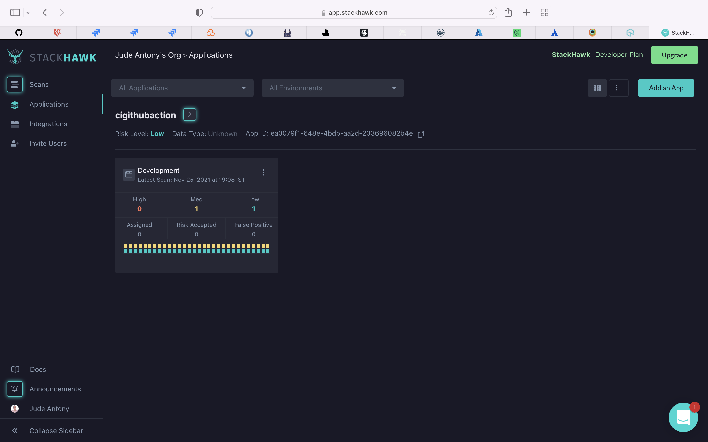

### 27) DAST Scan - Using OWASP ZAP. ###

[OWASP ZAP](https://github.com/marketplace/actions/owasp-zap-api-scan) is an open-source web application security scanner. It is intended to be used by both those new to application security as well as professional penetration testers. It is one of the most active Open Web Application Security Project projects and has been given Flagship status.

Use [OWASP ZAP](https://github.com/marketplace/actions/owasp-zap-api-scan) for DAST scan for all the [OpenAPI](https://swagger.io/specification/) (REST APIs). OWASP ZAP rule file is present [here](https://github.com/judebantony/cicd-github-action-example/tree/main/zap/).

```yaml 

  zap_scan:
      runs-on: ubuntu-latest
      name: DAST Scan using OWASP ZAP
      needs: [qatest, browserStackTest, lamdaTest]
       
      steps:
        - name: Checkout
          uses: actions/checkout@v2
          with:
            fetch-depth: 0
        - name: ZAP Scan
          uses: zaproxy/action-api-scan@v0.1.0
          with:
            token: ${{ secrets.GITHUB_TOKEN }}
            docker_name: 'owasp/zap2docker-stable'
            format: openapi
            target: 'http://35.194.14.180/api-docs'
            rules_file_name: 'zap/rules.tsv'
            cmd_options: '-a'

```
ZAP Scan Report:- 
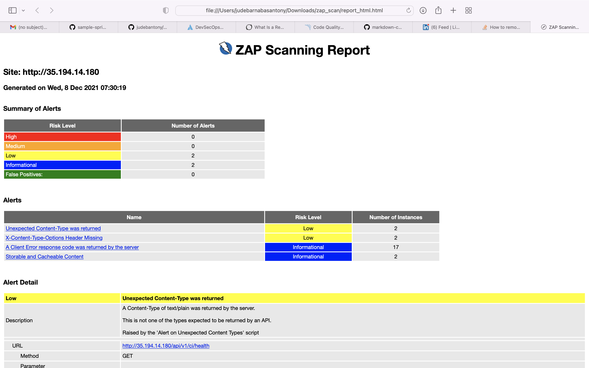
Result is uploaded in Github Action.
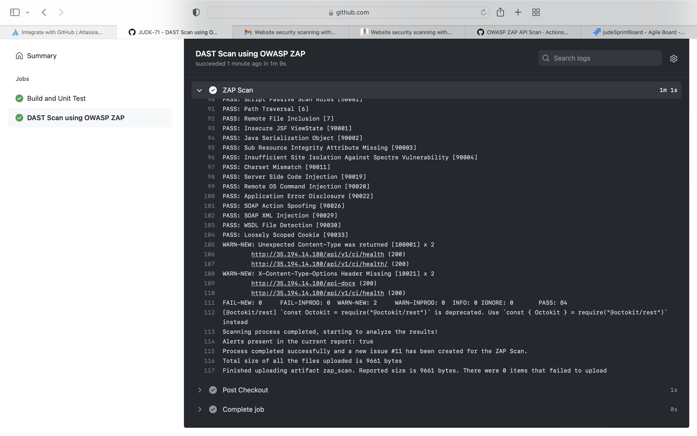
Issue created on GitHub
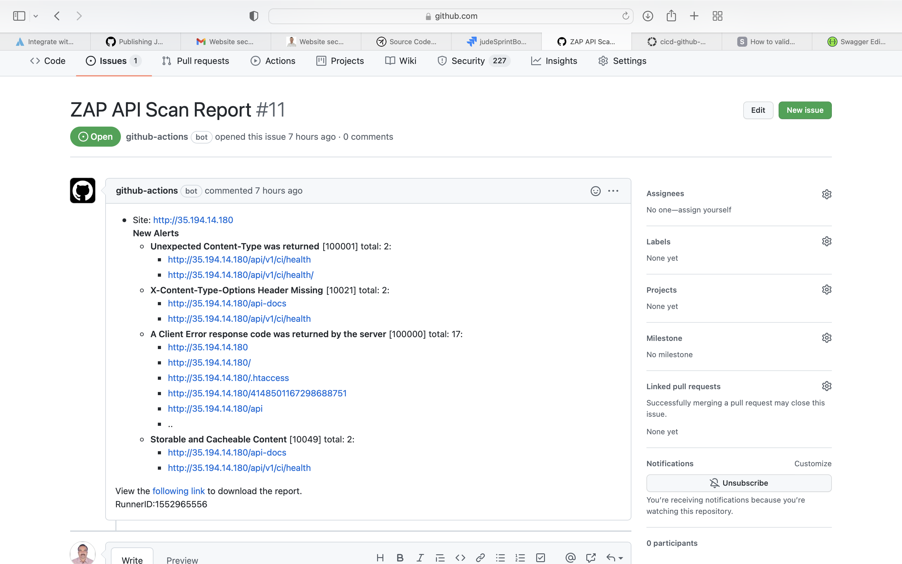

### 28) API Validator - Using Swagger Editor Validator. ###
[Swagger Editor](https://swagger.io/blog/api-design/validate-openapi-definitions-swagger-editor/) lets you edit Swagger API specifications in YAML inside your browser and to preview documentations in real time. Valid Swagger JSON descriptions can then be generated and used with the full Swagger tooling (code generation, documentation, etc).


Use [Swagger Editor Validator](https://swagger.io/blog/api-design/validate-openapi-definitions-swagger-editor/) for validating the [OpenAPI Specification](https://swagger.io/specification/) of REST APIs .

```yaml 

 test_swagger_editor_validator:
    runs-on: ubuntu-latest
    name: Swagger Editor Validator Remote
    needs: [stackhawkScan, zap_scan]
    steps:
      - name: Checkout
        uses: actions/checkout@v2
        with:
          fetch-depth: 0
      - name: Download OpenAPI Spec
        run: |
          curl http://35.194.14.180/api-docs > openapi.json
      - name: Validate OpenAPI definition
        uses: char0n/swagger-editor-validate@v1.2.1
        with:
          definition-file: openapi.json   

```
Build output:-
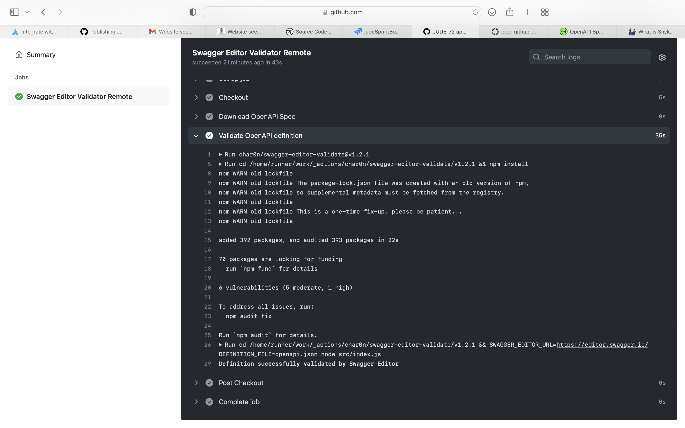


### 29) Setting up Approval Gates and Email. ###

Approval gates for deployment using [Github Environment](https://docs.github.com/en/actions/deployment/targeting-different-environments/using-environments-for-deployment) feature.

```yaml 

 stagingdeployapproval:
    name: Waiting for Staging Deployment Approval
    runs-on: ubuntu-latest
    needs: [stackhawkScan]
    environment: staging
    
    steps:
      - name: Email Status
        uses: dawidd6/action-send-mail@v3
        with:
          server_address: smtp.gmail.com
          server_port: 465
          username: ${{secrets.MAIL_USERNAME}}
          password: ${{secrets.MAIL_PASSWORD}}
          subject: Stage Deployment ${{github.repository}} waiting for your approval.
          to: judebantony@gmail.com
          from: judebantonyofficial@gmail.com
          body: Please review the test result and approve it.
          reply_to: judebantonyofficial@gmail.com
          in_reply_to: judebantonyofficial@gmail.com
          ignore_cert: true
          convert_markdown: true
          priority: low

```

### 30) CD - Deploy to Azure AKS using Helm. ###
[Helm](https://helm.sh) helps you manage [Kubernetes](https://kubernetes.io) applications — Helm Charts help you define, install, and upgrade even the most complex [Kubernetes](https://kubernetes.io) application.

Deploy the Container image to [Azure AKS](https://azure.microsoft.com/en-in/services/kubernetes-service/) using [Helm](https://helm.sh), manifest files are available [here](https://github.com/judebantony/cicd-github-action-example/tree/main/helm).

```yaml 

 stagingdeploy:         
    name: Staging Deployment Using Helm To AKS
    runs-on: ubuntu-latest
    needs: [stagingdeployapproval]

    steps:
      - name: Check out the code
        uses: actions/checkout@v1
        with:
          fetch-depth: 0
      - name: Install Helm
        uses: Azure/setup-helm@v1
        with:
          version: v3.7.1    
      - name: Login to JFrog  
        uses: docker/login-action@v1
        with:
          registry: 'https://judebantony.jfrog.io'
          username: ${{ secrets.ARTIFACTORY_USER }}
          password: ${{ secrets.ARTIFACTORY_PASSWORD }}        
      - name: Setting AKS Context 
        uses: azure/aks-set-context@v1
        with:
          creds: ${{ secrets.AZURE_CREDENTIALS }}
          cluster-name: 'JudeAKSCluster'
          resource-group: 'DefaultResourceGroup-EUS'
      - name: Create AKS Namespace     
        run: |
            kubectl create namespace cigithubactionstaging --dry-run -o json | kubectl apply -f -
      - name: Create Secret     
        uses: azure/k8s-create-secret@v1
        with:
          container-registry-url: 'https://judebantony.jfrog.io'
          container-registry-username: ${{ secrets.ARTIFACTORY_USER }}
          container-registry-password: ${{ secrets.ARTIFACTORY_PASSWORD }}
          namespace: 'cigithubactionstaging'
          secret-name: 'cigithubactionstaging-crd'
      - name: Run Helm Deploy
        run: |
         helm upgrade \
              --install \
              --create-namespace \
              --atomic \
              --wait \
              --namespace cigithubactionstaging \
              cigithubaction \
              ./helm/aks \

```
AKS Console:-

### 31) CD - Deploy to Google GKE using Harness. ###

The [Harness](https://harness.io) Software Delivery Platform includes Continuous Integration, Continuous Delivery, Continuous Efficiency, Continuous Verification, and Continuous Features. The platform is designed to help companies accelerate their cloud initiatives as well as their adoption of containers and orchestration tools like [Kubernetes](https://kubernetes.io) and [Amazon ECS](https://docs.aws.amazon.com/AmazonECS/latest/developerguide/Welcome.html).

Deploy the Container image to [Google GKE](https://cloud.google.com/kubernetes-engine/?utm_source=google&utm_medium=cpc&utm_campaign=japac-IN-all-en-dr-bkws-all-all-trial-e-dr-1009882&utm_content=text-ad-none-none-DEV_c-CRE_468709677813-ADGP_Hybrid%20%7C%20BKWS%20-%20EXA%20%7C%20Txt%20~%20Containers%20~%20Kubernetes%20Engine_Kubernetes-gke-KWID_43700033867246010-aud-970366092687%3Akwd-372556496315&userloc_9299054-network_g&utm_term=KW_google%20gke&ds_rl=1264446&gclid=CjwKCAiAhreNBhAYEiwAFGGKPBhVfsfPwkEB1Yzehiow3pcsq-P9Pv78G4P28anuVF9HtSPtoNZCFxoCqr0QAvD_BwE&gclsrc=aw.ds) using [Harness](https://harness.io).

```yaml 

  uatdeploy:
    name: UAT Deployment using Harness
    runs-on: ubuntu-latest
    needs: [uateployapproval]

    steps:
      - name: Run Harness UAT Deployment
        run: |
          curl -X POST -H 'content-type: application/json' --url https://app.harness.io/gateway/api/webhooks/Tlugr1ZdISx44rvm4flAiXHMb3uKG3ikyiHSbOks?accountId=aGS5Pi_WSPa9IsdlTlJc7g -d '{"application":"1FYrnQdZROqjpAQdCBIMbw"}'
```
GKE console:-
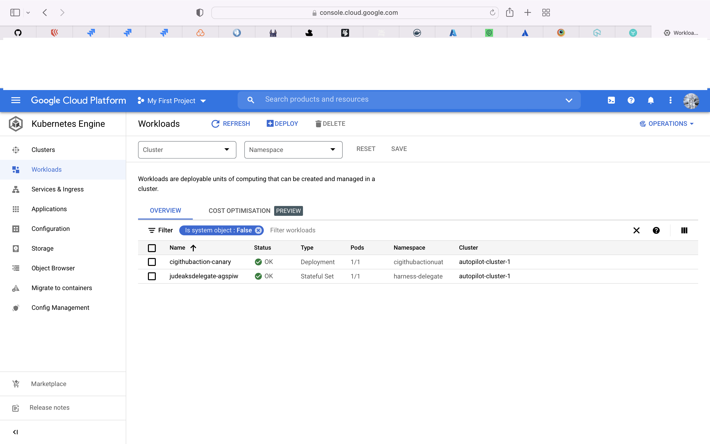

Harness console:-
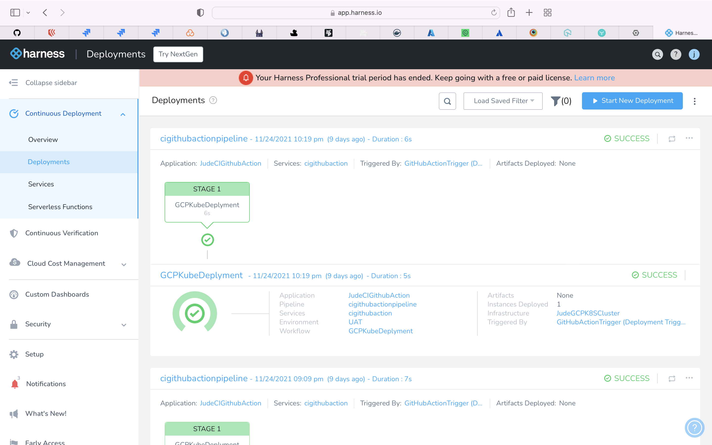 

### 32) Load/Performance Testing - K6. ###
[K6](https://k6.io) is an open-source load testing tool and cloud service providing the best developer experience for API performance testing.

Use [K6](https://k6.io) to do the Performance Test. Load Test file is present [here](https://github.com/judebantony/cicd-github-action-example/tree/main/k6-test.js).

```yaml 

  k6_cloud_test:
    name: Perf Testing - k6 cloud test run
    runs-on: ubuntu-latest
    needs: [terraform]
    steps:
      - name: Checkout
        uses: actions/checkout@v1
        with:
          fetch-depth: 0
      - name: Run k6 cloud test
        uses: k6io/action@v0.1
        with:
          filename: k6-test.ts
          cloud: true
          token: ${{ secrets.K6_CLOUD_API_TOKEN }}

```
K6 dashboard:-
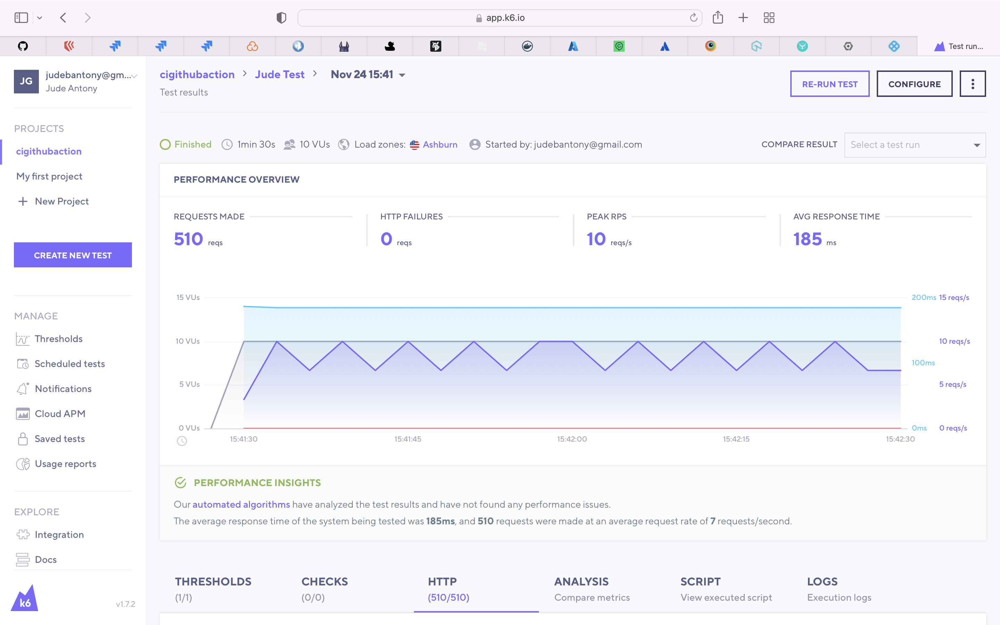

### 33) Functional Test using Xray and Jira. ###
[XRay](https://www.getxray.app) is a Test Management tool integrated with Jira. Built for every member of your team to plan, test, track and release great software · Manage all your tests as Jira issues.

Xray Jira plugin is used to create the test case in [Gherkin](https://cucumber.io/docs/gherkin/) and [Cucumber](https://cucumber.io) for each Jira story and executed as part of CI/CD pipleline(GitHub Action). The result is uploaded back to Jira. XRay Test Execution config file is present [here](https://github.com/judebantony/cicd-github-action-example/tree/main/testexec_cloud_template.json).

```yaml 

  jiraXrayTest:
    name: Functional Test using Xray and Jira 
    runs-on: ubuntu-latest
    needs: [uatdeploy]
        
    steps:
      - name: Check out the code
        uses: actions/checkout@v1
        with:
          fetch-depth: 0
      - name: Set up JDK
        uses: actions/setup-java@v1
        with:
          java-version: 1.8
      - name: Cache Maven packages
        uses: actions/cache@v1
        with:
          path: ~/.m2
          key: ${{ runner.os }}-m2-${{ hashFiles('**/pom.xml') }}
          restore-keys: ${{ runner.os }}-m2    
      - name: Get Xray Cloud API token
        env:
          CLIENT_ID: ${{ secrets.XRAY_CLIENT_ID }}  
          CLIENT_SECRET: ${{ secrets.XRAY_CLIENT_SECRET }}
        id: xray-token
        run: |
          echo ::set-output name=XRAY_TOKEN::$(curl -H "Content-Type: application/json" -X POST --data "{ \"client_id\": \"$CLIENT_ID\",\"client_secret\": \"$CLIENT_SECRET\" }" https://xray.cloud.xpand-it.com/api/v1/authenticate| tr -d '"')
      - name: Get Features from XRAY 
        shell: bash
        run: |
           curl -H "Content-Type: application/json" --output ./features.zip -X GET -H "Authorization: Bearer ${{ steps.xray-token.outputs.XRAY_TOKEN }}"  "https://xray.cloud.xpand-it.com/api/v1/export/cucumber?keys=JUDE-43"
           unzip -o features.zip -d ./src/test/resources/com/jba/ci/bdd/   
      - name: Build
        run: mvn -B clean package -DskipTests
      - name: Run UnitTest and Verify 
        run: mvn -B verify -DexcludedGroups="Smoke | Staging | BrowserStack | LamdaTest"
      - name: Generate JaCoCo Badge
        id: jacoco
        uses: cicirello/jacoco-badge-generator@v2
      - name: Log code coverage percentage
        run: |
          echo "coverage = ${{ steps.jacoco.outputs.coverage }}"
          echo "branch coverage = ${{ steps.jacoco.outputs.branches }}"
      - name: Upload to XRAY 
        shell: bash
        run: |
           curl  -X POST -H "Authorization: Bearer ${{ steps.xray-token.outputs.XRAY_TOKEN }}" -F info=@testexec_cloud_template.json -F results=@"target/cucumber-reports/cucumber.json" "https://xray.cloud.xpand-it.com/api/v1/import/execution/cucumber/multipart"          

```
Jira Xray test execution dashboard:-
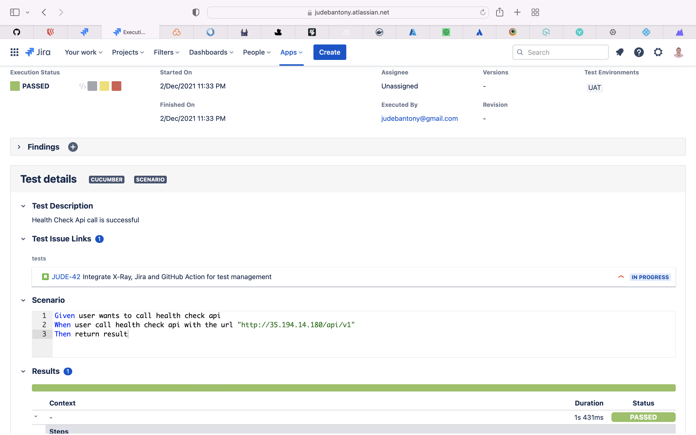

### 34) Release Tag Creation. ###
Create a release tag for the branch. 

```yaml 

  releaseTag:
      name: Release Tag Creation 
      runs-on: ubuntu-latest
      needs: [k6_cloud_test]
      steps:
        - name: Checkout
          uses: actions/checkout@v2
          with:
            fetch-depth: 0
        - name: Bump version and push tag
          id: tag_version
          uses: anothrNick/github-tag-action@1.26.0
          env:
            GITHUB_TOKEN: ${{ secrets.GITHUB_TOKEN }}
            WITH_V: true
        - name: Create a GitHub release
          uses: ncipollo/release-action@v1
          with:
            tag: ${{ steps.tag_version.outputs.new_tag }}
            name: Release ${{ steps.tag_version.outputs.new_tag }}
            body: ${{ steps.tag_version.outputs.changelog }}  

```
Release Tag:-
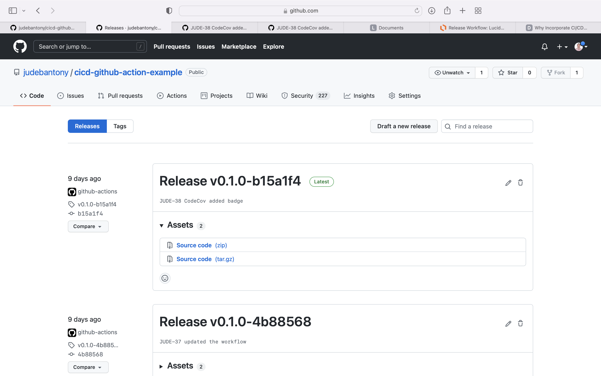

### 35) IaC - using Terraform - Create AWS EC2. ###
[Terraform](https://www.terraform.io) is an open-source infrastructure as code software tool created by HashiCorp. Users define and provide data center infrastructure using a declarative configuration language known as HashiCorp Configuration Language, or optionally JSON.

Set up the [AWS EC2](https://aws.amazon.com/ec2/?ec2-whats-new.sort-by=item.additionalFields.postDateTime&ec2-whats-new.sort-order=desc) instances using [Terraform](https://www.terraform.io) , terraform manifest file is available [here](https://github.com/judebantony/cicd-github-action-example/tree/main/terraform).

```yaml 

  terraform:
    name: "Terraform - Create AWS EC2"
    runs-on: ubuntu-latest
    needs: [uatdeploy]
    steps:
      - name: Checkout
        uses: actions/checkout@v2
        with:
          fetch-depth: 0
      - name: Setup Terraform
        uses: hashicorp/setup-terraform@v1
        with:
          cli_config_credentials_token: ${{ secrets.TF_API_TOKEN }}
      - name: Terraform Format
        id: fmt
        run: |
            cd terraform/
            terraform fmt -check
      - name: Terraform Init
        id: init
        run: |
            cd terraform/
            terraform init
      - name: Terraform Validate
        id: validate
        run: |
            cd terraform/
            terraform validate -no-color
      - name: Terraform Plan
        id: plan
        run: |
            cd terraform/
            terraform plan -no-color
        continue-on-error: true
      - uses: actions/github-script@0.9.0
        id: return_plan_outpot
        env:
          PLAN: "terraform\n${{ steps.plan.outputs.stdout }}"
        with:
          github-token: ${{ secrets.GITHUB_TOKEN }}
          script: |
            const output = `#### Terraform Format and Style \`${{ steps.fmt.outcome }}\`
            #### Terraform Initialization ️\`${{ steps.init.outcome }}\`
            #### Terraform Validation \`${{ steps.validate.outcome }}\`
            #### Terraform Plan \`${{ steps.plan.outcome }}\`
            <details><summary>Show Plan</summary>
            \`\`\`\n
            ${process.env.PLAN}
            \`\`\`
            </details>
            *Pusher: @${{ github.actor }}, Action: \`${{ github.event_name }}\`*`;
            return output;
      - name: Create plan result
        uses: "finnp/create-file-action@master"
        env:
          FILE_NAME: "plan.html" 
          FILE_DATA: "${{steps.return_plan_outpot.outputs.result}}"     
        
      - name: Upload Terraform Plan result
        uses: actions/upload-artifact@v2
        with:
          name: terrform-plan-result
          path: plan.html
             
      - name: Terraform Plan Status
        if: steps.plan.outcome == 'failure'
        run: exit 1
        
      - name: Terraform Apply
        run: |
            cd terraform/
            terraform apply -auto-approve  

```
Terraform dashbord:-
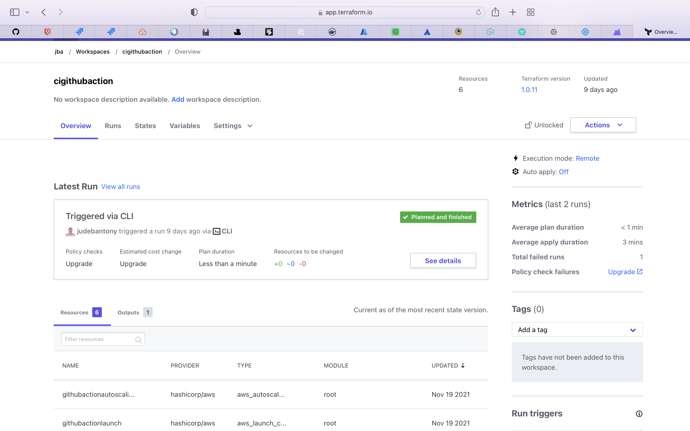

## Author

* **Jude Antony** ([LinkedIn](https://www.linkedin.com/in/jude-antony-2b208219/)) - ([GitHub](https://github.com/judebantony))

## License

This project is licensed under the Apache License - see the [LICENSE](LICENSE) file for details
